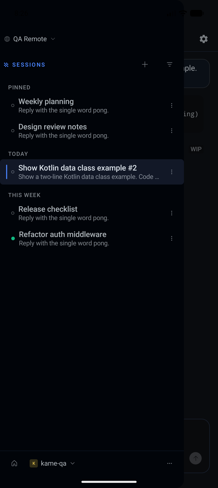
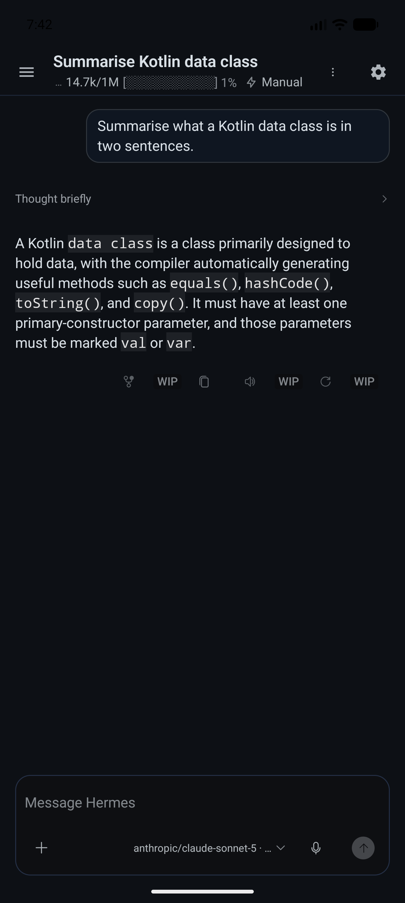
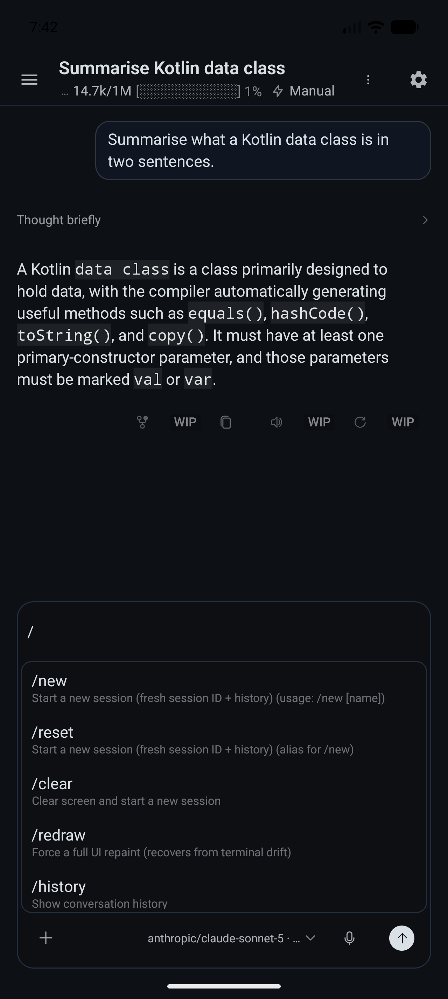
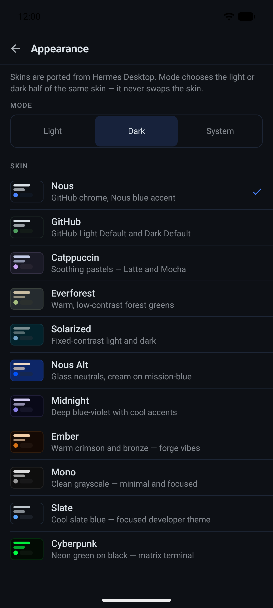
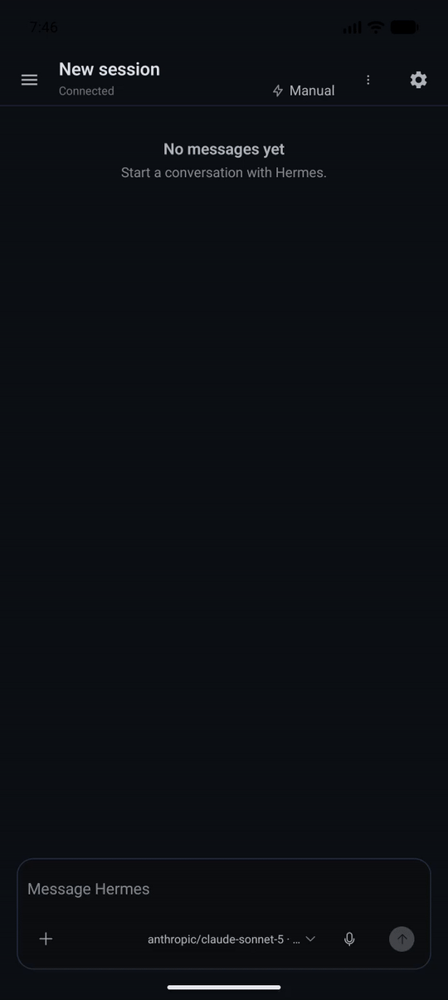
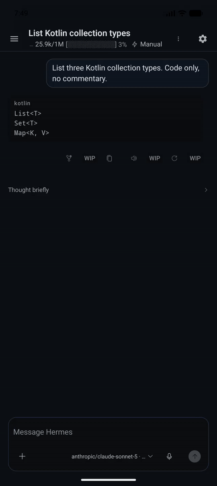

# Hermes Mobile

A native Kotlin and Jetpack Compose Android client for a **self-hosted Hermes
Agent**. It hosts no runtime of its own: it connects to a Hermes you already
run, and gives you that agent's sessions, live turns and tools on a phone.

<!-- Captures are added by the media lane; see docs/media/README.md for the
     agreed file names and the capture rule. -->
<p align="center">
  
  
  
  
</p>

<p align="center">
  
  
  
</p>

<p align="center"><sub>More captures, and the rule they are taken under, in
<a href="docs/media/README.md"><code>docs/media/</code></a>.</sub></p>

## Three ways to connect

**Remote Gateway — recommended.** You run `hermes serve` on a host you own and
put an HTTPS URL in front of it; Desktop and this app each sign in
independently, over browser PKCE, against that one Gateway and its one session
database. The app never starts, adopts, stops or reaps that process — it is
host-owned, which is what makes sharing it safe. The simplest way to get an
HTTPS URL without exposing anything to the internet is Tailscale, covered in
the [getting-started guide](docs/guides/getting-started.md#tailscale-tips).

**Managed SSH — fallback.** When you want a *private* backend that belongs to
this phone rather than a shared one, the app opens an SSH connection to a host,
starts its own `hermes serve` there, and forwards it over the tunnel. It parses
one destination field, requires an explicit first-use host-key review, refuses a
changed host key outright, and uses exactly one authentication method with no
fallback chain. Use it as a fallback, not as a second server against a Hermes
profile a Remote Gateway is already serving.

**Local — a Hermes on this same phone.** If you run `hermes serve` under
[Termux](https://termux.dev) on the phone itself, save it as a Local connection
and the app reaches it over loopback. Cleartext HTTP is permitted for exactly
`127.0.0.1`, `localhost` and `::1` and refused everywhere else. Like Remote,
this route owns no process: the app connects to the Hermes you started and
never starts, stops or reaps it. Setup is in the
[Termux local Gateway guide](docs/guides/termux-local-gateway.md).

```text
Desktop ───────┐
               ├── Remote Gateway ── one Hermes profile and session database
Mobile ────────┘
```

> One Remote Gateway safely shares its process and session storage, but until
> the Gateway ships multi-client event fan-out, do not open or control the
> **same running session** from Desktop and mobile at once. Different sessions
> are fine.

## Getting started

Install the APK, pick a route, stand the Gateway up:
**[docs/guides/getting-started.md](docs/guides/getting-started.md)**.

## Desktop vs Mobile

This is an active client, not a complete port of every Hermes Desktop surface.
**Supported** means there is a tested native counterpart, not that the UI is
identical. **Partial** names a useful implemented subset. **Not yet** means
there is no dedicated mobile surface. The evidence and limits behind every row
are in [Status and roadmap](status/ROADMAP.md).

| Area | Hermes Desktop | Hermes Mobile |
|---|---|---|
| Connecting | Local and remote Gateway workflows | **Supported** — Remote Gateway over HTTPS with independent browser PKCE, Managed SSH as a private fallback, and Local over loopback to a Termux Hermes |
| Sessions and projects | Create, browse, search, group, rename, pin, archive, and project views | **Partial** — list, create, open, paged history, date and project grouping, unread and running state, rename, delete, pin, archive/restore, read-state, and backend session search; no branch, export, move-to-project or bulk selection |
| Live chat and transcript | Streaming conversation, Markdown, tools, progress, and media | **Supported** — streamed messages, reasoning and tool rows, ANSI terminal output, Markdown tables and code, inline diffs, image thumbnails and a lightbox, plus paged backfill and per-reply copy |
| Composer and model controls | Rich editor, references, completions, model, effort, and fast mode | **Supported** — multiline drafts, history and undo, a per-connection model shortlist, the full reasoning scale, fast mode, slash/path/session/emoji completion, a context meter, and the Manual/Smart/Off approval mode |
| Turn control and queues | Send, stop, redirect/steer, queue, park, and send next | **Supported** — target-session isolation, concurrent sends to distinct sessions, durable text queues, edit/delete/park/resume, redirect, steer, stop, and send next |
| Required input | Clarification, approvals, sudo, and secret prompts | **Supported** — single and batch clarification, Gateway-offered approval choices, and secure wiped sudo/secret entry |
| Attachments | Files, images, folders, paste, and drag/drop | **Partial** — Android file and image picking, bounded staging, preview chips, image-only send, thumbnails and lightbox; no folders, clipboard images or drag/drop |
| Voice | Dictation, conversation, auto-speak, wake word, and barge-in | **Partial** — dictation, conversation, auto-speak and a user-started wake-word service; barge-in and device evidence are open |
| Agent status | Goals, tasks, subagents, background work, previews, queues, and compaction | **Supported** — task list and counts, goals, subagents, processes, previews, queue state, progress, and compaction |
| Coding context and review | Branch/worktree, pull requests, Git status, diff, files, editor, terminal, and review panes | **Partial** — branch and worktree, PR link, ahead/behind and diff counters, and changed-file metadata; no patch contents, editor, files pane or terminal |
| Profiles | Full profile management and the SOUL editor | **Partial** — a profile rail that scopes the session list, an all-profiles view, and a read-only roster; no creating, renaming, deleting or editing |
| Notifications | Desktop notifications from a persistent process | **Partial** — approvals, questions, sudo/secret prompts and finished turns while a Gateway socket is live, answerable from the shade; nothing arrives once the socket is gone |
| System panel and updates | Gateway status, restart, backend update, and logs | **Partial** — status, messaging-gateway restart and `hermes update` with a grouped changelog; `Recent logs` ships disabled, and none of it has run against a real host yet |
| Relay channels | Full plugin surface | **Partial** — channel list, one channel's transcript and sending; no editing, threads or Harnesses inspector |
| Appearance | Built-in and custom themes plus Desktop chrome | **Partial** — all six built-in themes at the pinned Desktop authority, system/light/dark mode, and mobile chat chrome; no custom themes |
| Desktop workbench | Multi-pane files, terminal/PTY, review, and desktop window workflows | **Not yet** — the changed-file sheet is the only native workspace view |
| Other management surfaces | Bots, schedules, memory, knowledge, workflows, tools/skills/MCP, plugins, Kanban, and messaging settings | **Not yet** — no dedicated mobile screens; agents can still use Gateway-exposed capabilities in chat |
| Background lifecycle | Persistent desktop process | **Partial** — reconnect, a turn-scoped foreground service and a wake-word service exist, but uninterrupted background connectivity is not claimed |

Where Desktop has a control this app does not implement yet, the control is
still on screen and disabled behind a `WIP` marker rather than quietly missing.

Two honesty notes the table cannot carry. Automated coverage is broad — unit
tests, Robolectric journeys and an instrumented emulator lane on every build —
but **full physical-device acceptance is not finished**: the browser sign-in
hand-off in particular has never been run screen-off on a real phone. And the
System panel's backend update has never been run against a real host. Both, and
the rest, are itemised in
[Known limitations](status/ROADMAP.md#known-limitations).

## Install the rolling APK

There is no store listing and no production release channel yet. The project
ships **one rolling debug-signed APK** from the latest successful `main` build.
Treat it as a development channel.

1. Open the
   [Android exact-head workflow](https://github.com/donovan-yohan/hermes-agent-android/actions/workflows/android-exact-head.yml).
2. Select the newest successful run on `main`.
3. Download the `hermes-mobile-latest` artifact. GitHub requires sign-in to
   download Actions artifacts.
4. Unzip it and install:

   ```bash
   adb install -r app-debug.apk
   ```

The rolling artifact uses a persistent debug signing identity, so a newer
rolling build updates an earlier rolling install in place. It cannot update a
debug APK you built yourself, because that one is signed by a different key.
Older rolling artifacts are pruned once the replacement uploads, and the
remaining one expires after 90 days.

## Build and verify

Requirements: JDK 17 and an Android SDK with platform 36 and build-tools 35/36.

```bash
export ANDROID_HOME=/path/to/android-sdk
./gradlew check assembleDebug
```

The debug APK lands at `app/build/outputs/apk/debug/app-debug.apk`.
`./gradlew check` runs debug and release unit tests, Android lint, product-copy
checks, theme and composer parity contracts, and repository invariants. The
instrumented lane is separate:

```bash
./gradlew :app:connectedDebugAndroidTest   # needs an attached device or emulator
```

## Security boundaries

- **Secrets are in-memory only where they can be.** Managed SSH passwords,
  passphrases and imported private-key bytes are zeroed after use and wiped
  when the connections screen goes away.
- **Two credentials have a disk slot**, and they share one mechanism: a Remote
  connection's OAuth tokens and a Local connection's Hermes session token. Both
  are encrypted with the Android Keystore, stored outside backup, one file per
  saved connection, bound to the Gateway that minted them, and refused if that
  connection later points somewhere else. Removing the connection zeroes and
  unlinks the credential.
- **Everything else about a connection is ordinary settings**: a label, the
  route, the Gateway URL and sign-in provider, and the SSH host, port, username,
  auth method and accepted fingerprint.
- **Host keys are reviewed, never assumed.** There is no accept-all verifier,
  and a changed host key has no accept path. One authentication method is tried,
  once, with no fallback chain.
- **Cleartext HTTP is loopback-only** — exactly `127.0.0.1`, `localhost` and
  `::1`, enforced by the network security config and a build gate.
- **Nothing sensitive is printed.** Credentials, host names and fingerprints
  must not reach logs, UI status, argv, screenshots, ordinary preferences or
  repository fixtures, and user-visible values are redacted.
- **One host-owned Remote Gateway is the sharing model.** Separate app-owned
  Gateways must not target the same `HERMES_HOME`.

## Documentation

- [Getting started](docs/guides/getting-started.md) — install, pick a route,
  stand the Gateway up
- [Termux local Gateway](docs/guides/termux-local-gateway.md) — running Hermes
  on the phone itself
- [Status and roadmap](status/ROADMAP.md) — what works, what the evidence is,
  and what is deferred
- [Architecture](docs/phase-2-architecture.md) — connection sequence and state
  map
- [Remote Gateway decision](docs/adr/0002-shared-remote-gateway.md) and
  [Managed SSH decision](docs/adr/0001-ssh-probe-to-tunnel.md)
- [Third-party notices](THIRD_PARTY_NOTICES.md)

## Contributing

Hermes Desktop is the specification for every ported surface, so a UI change
carries evidence rather than an opinion:

- [`AGENTS.md`](AGENTS.md) is the repository map and the list of non-obvious
  rules — read it first.
- Porting a Desktop surface follows
  [`docs/workflows/port-desktop-surface.md`](docs/workflows/port-desktop-surface.md);
  reviewing one follows
  [`docs/workflows/review-desktop-parity.md`](docs/workflows/review-desktop-parity.md),
  which wants a rendered Desktop-versus-Android comparison and a classified
  divergence ledger in [`docs/parity/`](docs/parity).
- Theme changes are data edits checked by
  [`docs/workflows/sync-desktop-themes.md`](docs/workflows/sync-desktop-themes.md),
  and user-visible strings by
  [`docs/workflows/review-product-copy.md`](docs/workflows/review-product-copy.md).
- `./gradlew check` must pass. It includes the repository invariants in
  [`scripts/`](scripts), which enforce several of the rules above at build time.
