# Bot avatar paired evidence — bounded acceptance

**Outcome: the corrected Android debug fixture and real Desktop editor now have paired evidence for all eight catalog states in light and dark. This is a limited behavioral comparison, not pixel or interaction equivalence.** Clear semantics still diverge, and broader Bot appearance work remains under #194. This report replaces the earlier missing-capture status, not those unresolved product obligations.

## What the evidence establishes

- **32 validated v1 receipts and 32 unmodified editor PNGs:** 16 Android, 16 Desktop; eight states × two themes per platform. [Publication verification](publication-verification.json) enumerates every pair, source file hash and reconstruction check. Schema acceptance alone is not semantic acceptance.
- **Android:** API 37 emulator; production editor mounted in a corrected painted/inset-safe debug fixture. States are staged through synthetic in-memory RPC and captured with ordered accessibility/scroll actions. There is no real Android OS picker gesture or runtime RPC/ticket exporter in this evidence. Save/clear use the fixture's production view-model flow, with inline outcomes.
- **Desktop:** actual Electron component tree at `587e673e2a2fae0616d8b750bb189217080f621a`, disposable E2E mock Gateway and disk. Fourteen fresh journey/refusal captures plus two earlier successful pending captures retain their original identities. No production Desktop code or bundle was changed. [Desktop report](desktop/REPORT.md) records diagnosis, real interactions and execution results.
- Native Desktop picker cancellation is real: Escape in the focused Open File window emitted a trusted `cancel` event with zero files, unchanged preview and no writes. Upstream only resolves `onchange`; this does **not** prove a resolved-null cancellation promise. [Event](desktop/native-events.json), [window proof](desktop/native-window-proof.json), [supplementary OS screenshot](desktop/native-picker.png).
- Desktop save wrote 2,375 PNG bytes matching the disk asset; Android shows an inline save/readback result. Desktop closes its shared dialog and must be reopened. [Saved bytes](desktop/saved-disk-outcome.json).
- **Clear is intentional non-equivalence:** Android removes the asset and confirms absence in its fixture. Desktop clears, then rasterizes/reuploads its fallback shape, so an asset exists again. [Clear outcome](desktop/clear-outcome.json). This is retained **drift**, not absence parity, and remains tracked by #194.

## State boundaries

| State | Android | Desktop | Interpretation |
|---|---|---|---|
| loaded | Synthetic read, blue preview | Real Gateway/disk named read, blue preview before opening | Comparable loaded preview; different fixture inputs |
| loading | Explicit loading label; pending synthetic request | Actual pending request; silent shape fallback | Different presentation; unchanged Android 60-second deadline |
| picking | Staged production picking state | Actual native picker open; underlying editor crop unchanged | Android does not establish OS-picker gestures |
| cancel | Staged cancelled result and inline notice | Trusted native cancel; no notice, preview unchanged | Different action and presentation boundaries |
| error | Synthetic read refusal, inline retry guidance | Injected named initial-read refusal, shape fallback | Not the same error UI |
| changed | Staged normalized orange image | Genuine file selection and production normalization | Unsaved preview counterpart, not equal action proof |
| saved | Inline production save/readback | Save closes dialog; disk bytes verified; reopened preview | Different presentation boundaries |
| cleared | Inline clear/readback, confirmed fixture absence | Clear then shape-raster reupload; reopened shape | Documented asset-semantics drift; unresolved #194 |

Android loading postchecks were 12.593s light / 12.598s dark, below the unchanged 60-second deadline. No time, theme, state, SHA or receipt was restamped for publication. SystemUI clock text is incidental, not normalized fixture proof.

## Paired original images

The original files, not scaled composites, are the evidence. Markdown renders the same native PNG bytes at display size. Android captures the standalone phone editor; Desktop crops its shared dialog. These intentionally differ in framing and dimensions.

| State / theme | Android (fixture-staged) | Desktop (real editor) |
|---|---|---|
| loaded / light | 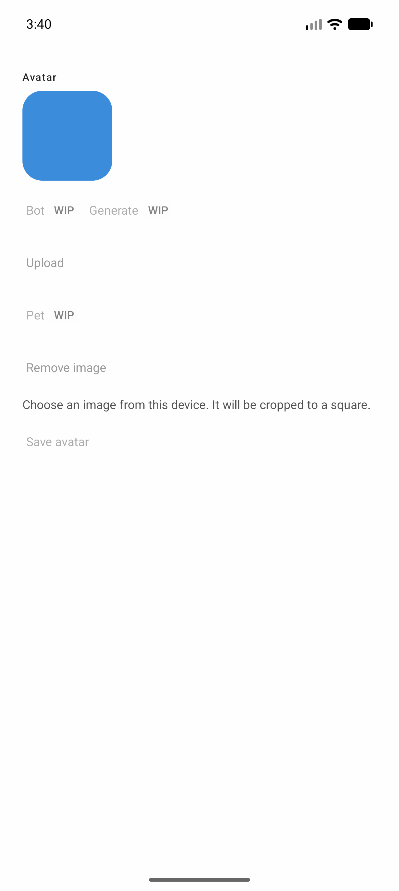 | 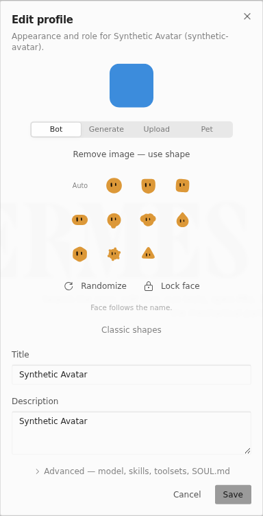 |
| loaded / dark |  | 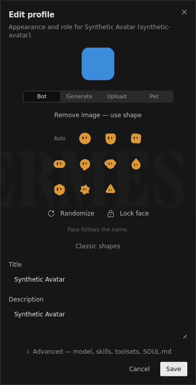 |
| loading / light | 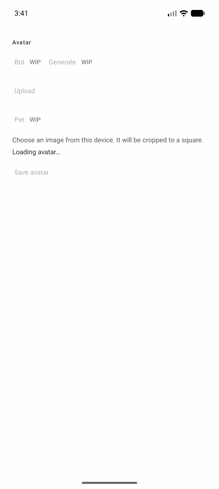 | 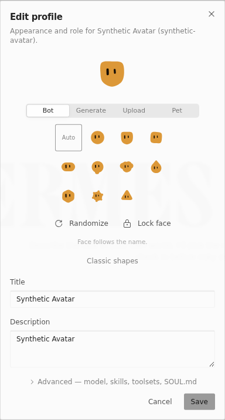 |
| loading / dark | 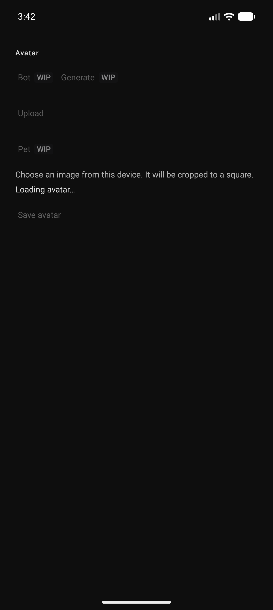 |  |
| picking / light | 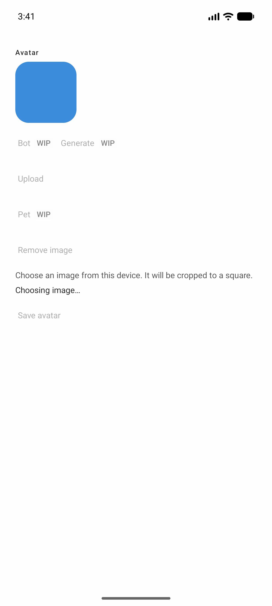 |  |
| picking / dark | 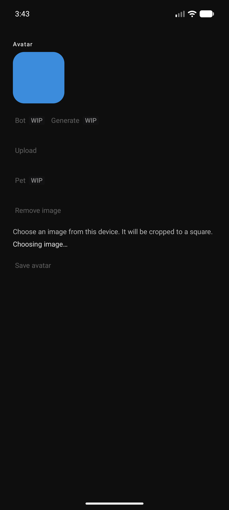 |  |
| cancel / light | 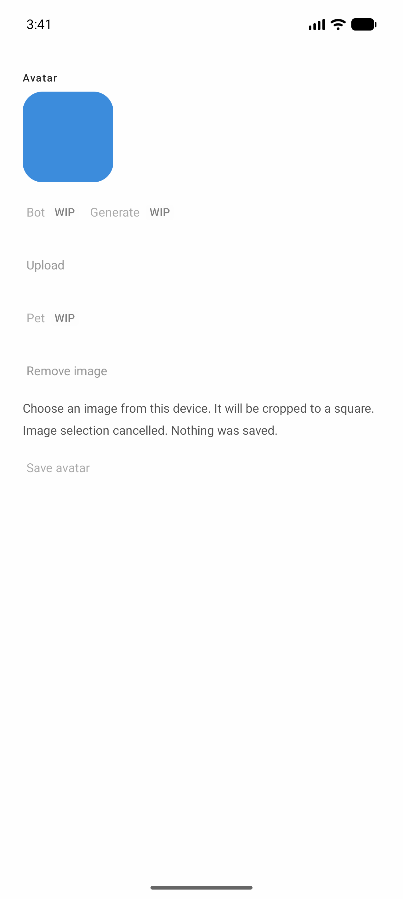 | 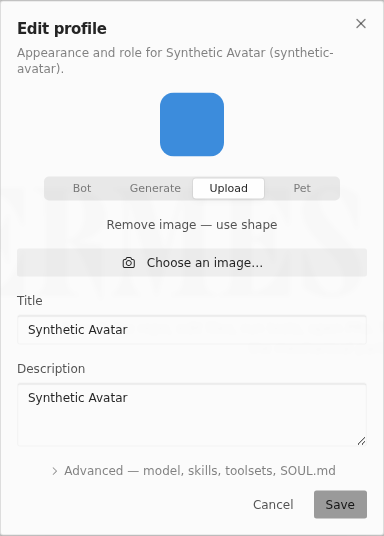 |
| cancel / dark |  | 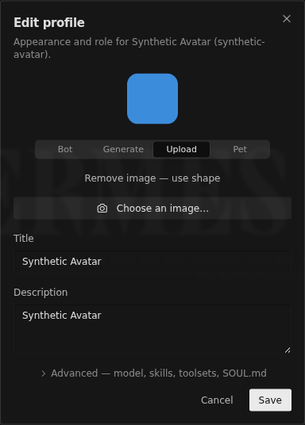 |
| error / light | 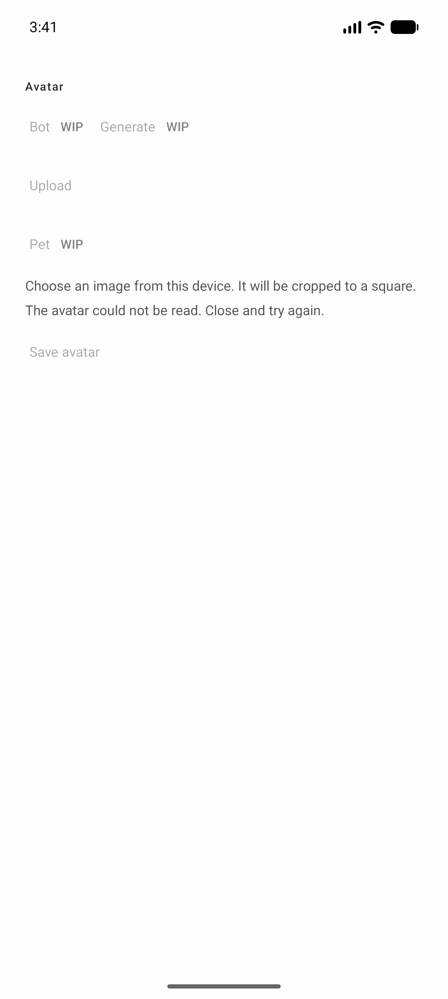 |  |
| error / dark | 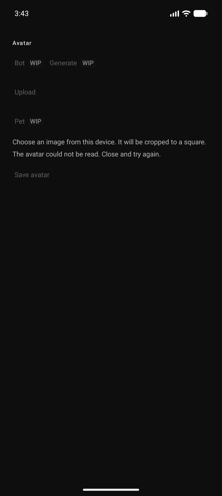 |  |
| changed / light | 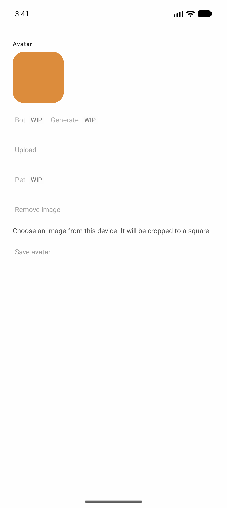 | 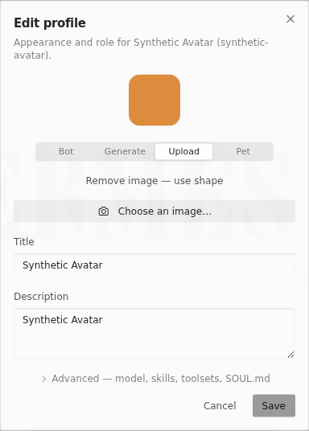 |
| changed / dark | 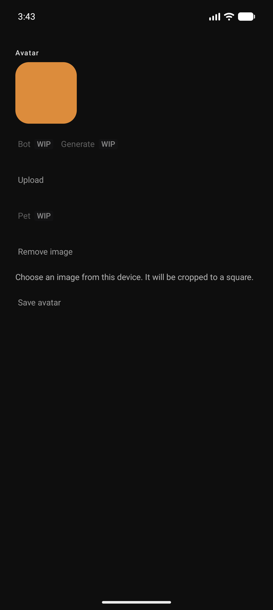 | 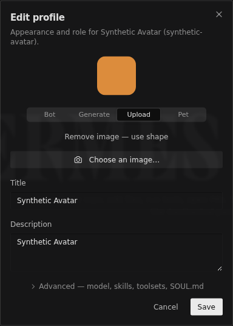 |
| saved / light |  | 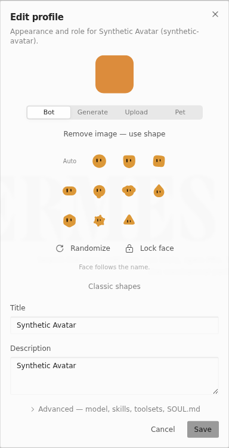 |
| saved / dark | 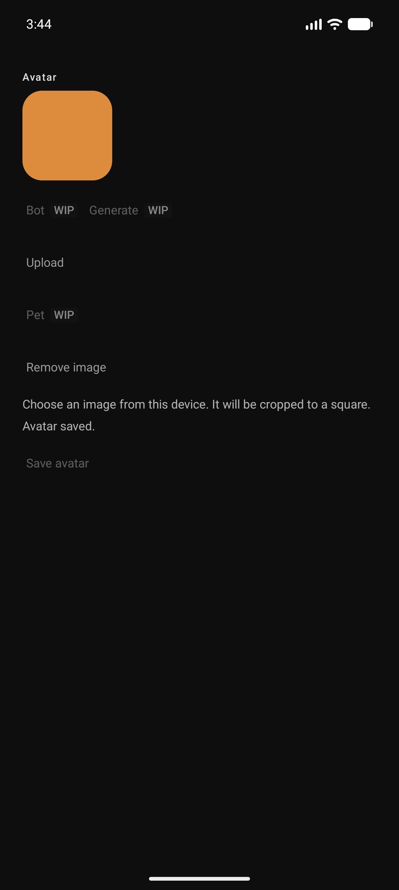 | 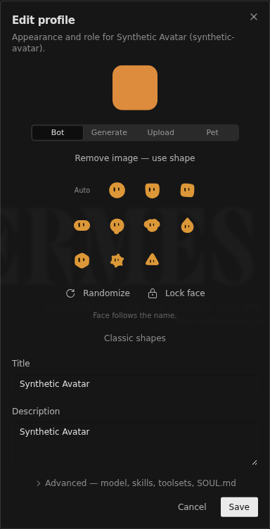 |
| cleared / light | 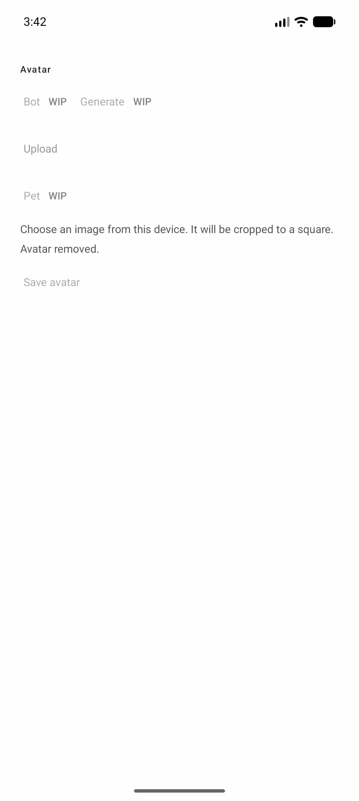 |  |
| cleared / dark | 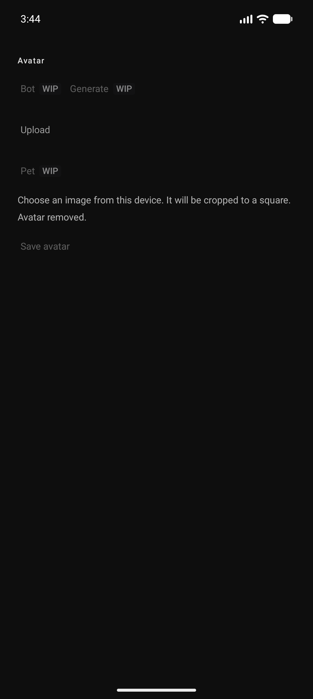 | 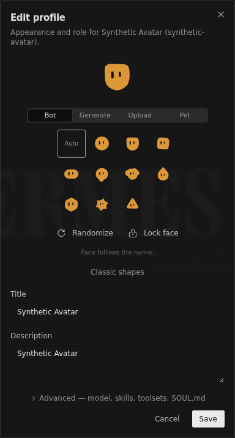 |

## Immutable capture provenance and reproduction

Android was built from **dirty base `0cc6ea3564fc268b8572e4f27c59e02c3f23546b` plus the exact retained patch**, including the six readiness files from `fbdda921252df85b1f73f8a1342f21ce59a61128`. It was not built from the eventual publication commit. [Build provenance](provenance/build-provenance.json), [exact source patch](provenance/android-working-tree.patch), [603-entry source manifest](provenance/android-source-hashes.json).

APK SHA-256 and independently pulled installed-byte hash: `d3f30a1aef2cb15ab2c58b97d90d0606a32a850dc233f06fa2a4553528c62a27`. APK binaries are deliberately not published. The patch SHA-256 is `6f04708ee81908ec45128790cf8b12854f7ed10e0e77ac9ca7793f0ec10b29a0`. Original failed-packet hashes remain in [the historical manifest](provenance/original-packet-hashes.json); those failed images remain retained separately, not relabeled as this acceptance set.

To reconstruct Android, export the base into a fresh disposable directory, initialize it as a Git repository, then run `git apply <packet>/provenance/android-working-tree.patch`. Compare every source file SHA-256 against the retained manifest before any build. Publication re-executed this check and matched all 603 entries. Initializing the directory prevents an enclosing repository from silently skipping paths. No Gradle execution is required to verify reconstruction.

Desktop's [additive capture patch](desktop/desktop-additive-fixtures.patch) reconstructs both journey/refusal specs; the pending-only [diagnostic patch](provenance/desktop-additive-fixture.patch) reconstructs [its spec](provenance/avatar-diagnostic.spec.ts). Apply each with `git apply` in an initialized disposable export and compare fixture hashes. Publication independently reconstructed all three capture specs. Use the real upstream E2E bootstrap, synthetic seed PNGs, and commands in [Desktop reproduction](desktop/REPORT.md#reproduction); never a real user profile. The readiness diagnostic spec is included as a standalone supplemental reproducer.

## Verification scope and publication safety

The build lane previously ran full `check assembleDebug --rerun-tasks --no-parallel --max-workers=1`: **3,303 debug tests and 2,618 release tests, zero failures/errors and one skipped in each configuration**. [Retained build checks](provenance/checks.json). Those results belong to the dirty capture snapshot above, not a claim that the later publication head was rebuilt. The publication lane ran no Gradle and performed no PR merge; it revalidated receipt schemas, image hashes, patches and static repository gates instead. Local main integration preserves the six pre-applied readiness files byte-for-byte; the retained capture identities still name the original dirty base and patch.

Only allowlisted synthetic PNGs, XMLs, receipts, derived assertions, fixture specs/patches and curated reports are published. The sole `git diff --check` exception is `provenance/android-working-tree.patch`: its original context-line spaces and terminal blank line are hash-significant reconstruction evidence and are deliberately unchanged. All other publication changes must pass the whitespace gate. No APKs, private paths, device serials, raw private logs or user profiles. Original capture bytes remain unchanged. Supplemental native-picker pixels are OS evidence, not a ninth state or themed Android/Desktop pair. Two small seed PNGs are fixtures, not acceptance screenshots. Low-contrast disabled controls remain; this is not accessibility contrast certification.

See [media capture index](../CAPTURE.md#bot-avatar-v1-supplement), [feature ledger](../../parity/bot-avatar-editor.md) and [acceptance history](../../parity/bot-avatar-visual-acceptance.md). Broader shape/color authoring, Generate, Pet, new/duplicate authoring and strict UI equivalence remain outside this bounded evidence; Refs #194.
