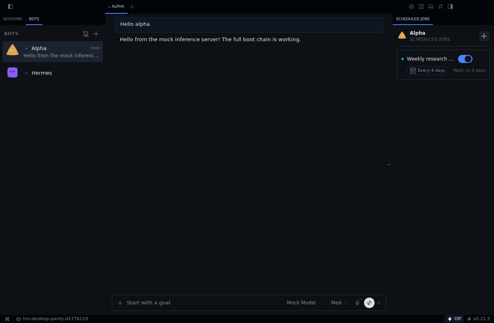
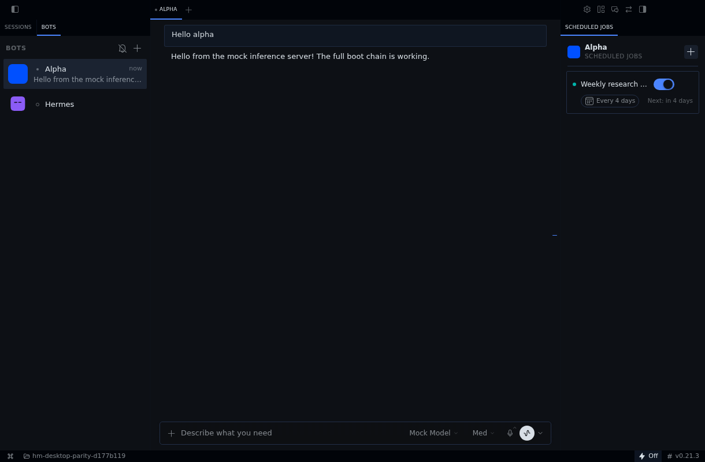

# Pinned Desktop Bot rendering evidence

These packets establish that the real Desktop Routines and Bots-avatar render paths can run at upstream `d177b119e9c56c9ddc0b7379ffce52341ec06584`. They are **not** completed Android parity reports, catalog-validated receipts, physical-device acceptance, or live external-model evidence.

## Routines

The existing upstream `apps/desktop/e2e/bot-routines-pane-narrow.spec.ts` runs the real Desktop shell, Gateway, temporary profile and cron store with a mock inference provider. Its test checks narrow-pane geometry, toggling the real job, closing the pane and restoring it. The run passed one test. The long title is intentionally ellipsized; schedule, next-run text and switch remain within the pane.

The capture-only patch emulates dark system appearance and asserts the actual rendered HTML mode. Production source was unchanged. `routines/provenance.json` records the upstream SHA, modified fixture hash and screenshot hashes; `capture-only.patch` records the complete fixture delta. Remaining images show the toggled, closed and restored states and the runner's final screenshot.

## Bots avatar

The second run adds a generated 32-pixel blue PNG to the temporary Alpha profile's `assets/avatar.png` before Desktop launches. The real Gateway serves it, and the test asserts the roster image is visible, uses a PNG data URL and has the expected decoded width. The same E2E test passed. The screenshot shows the blue image in the Bots roster and Scheduled Jobs header.

This proves **BotFace**, not profile-rail avatars. Desktop's separate `ProfileGlyph` remains a home/initial fallback at this pin. A BotFace screenshot cannot be presented as proof of ProfileGlyph image behavior. The fixture delta and hashes are retained under `avatar/`.

## Reproduction

1. Export the immutable upstream SHA into a disposable directory with `git archive`. Do not execute the installed upstream checkout or use a personal Hermes profile.
2. Honor the root Node/npm engine constraints. These runs used Node 24.16.0 and npm 11.17.0, installing the committed lockfile's Desktop, tests-js and root dependencies.
3. Run `uv sync --frozen --no-dev`. The fixture also expects root `venv/bin/python`; this export used a root-local `venv -> .venv` compatibility symlink.
4. Build with `npm run build --workspace apps/desktop`.
5. Apply exactly one packet's `capture-only.patch` to a fresh exported fixture. The avatar patch already includes dark-mode configuration; do not stack the two patches.
6. Provide an isolated headless display. These runs used Xvfb with TCP disabled, verified with `xdpyinfo`.
7. From `apps/desktop`, run `../../node_modules/.bin/playwright test e2e/bot-routines-pane-narrow.spec.ts --workers=1 --reporter=line` with that display. Logs are retained in each packet.

## Remaining acceptance

The Android fixture inputs differ from these Desktop scenarios. Before a final parity verdict, align the relevant states, validate the repository capture receipts, bind Android APK/install evidence to its exact candidate and inspect both sides. Missing aligned evidence is not a missing Desktop renderer. No existing surface ledger is silently upgraded to approved by this packet.
