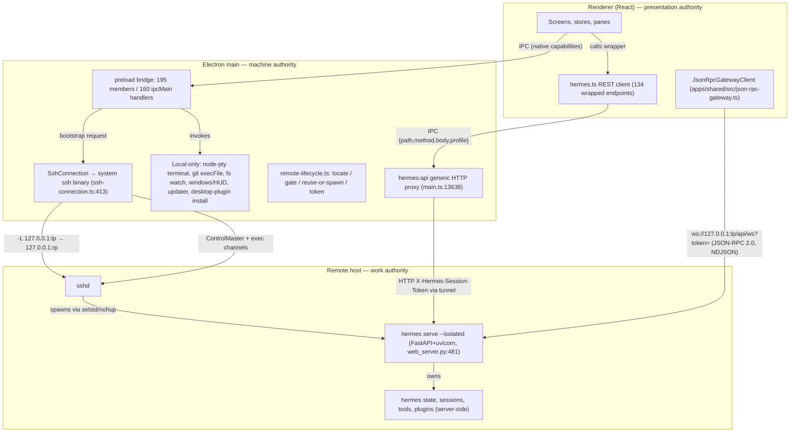
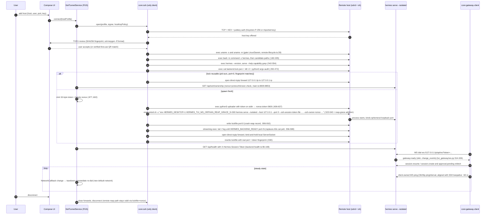
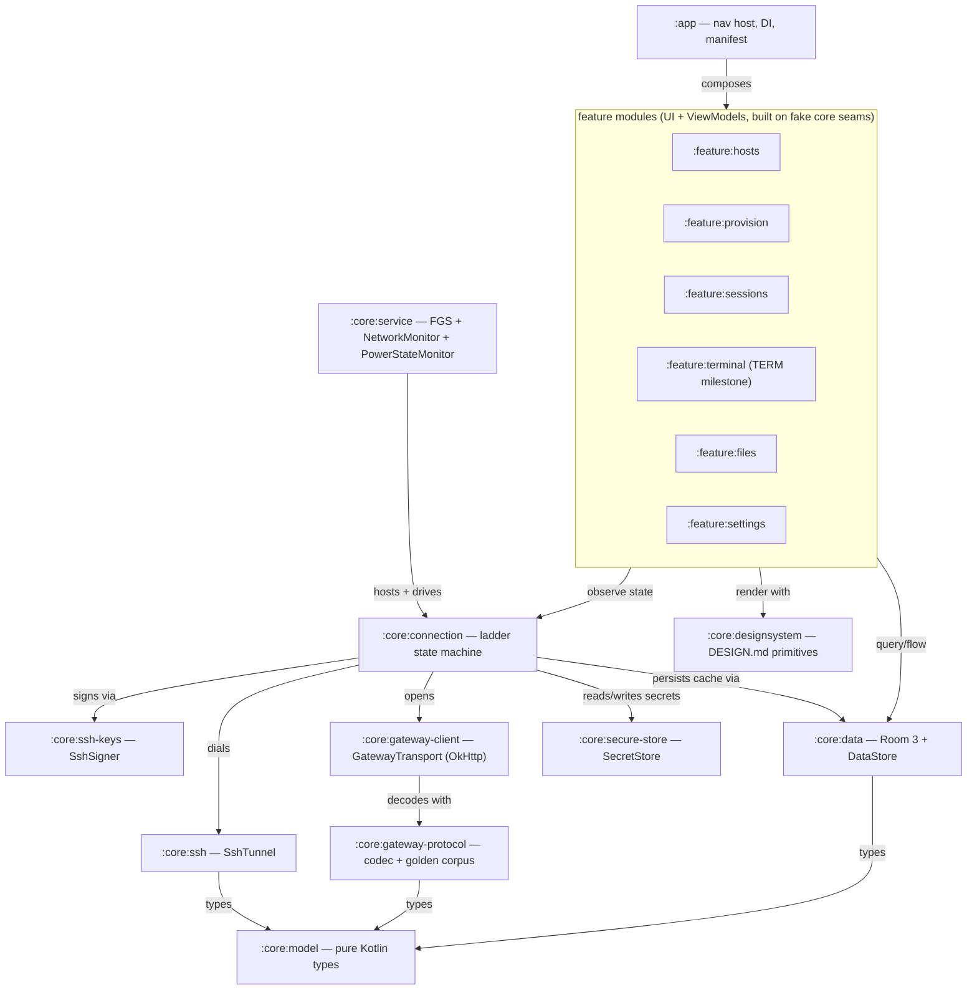

# Native Kotlin SSH Client for Hermes Desktop — Architecture Scope

> Historical research scope. Its SSH-only product premise is superseded by
> [ADR 0002](../adr/0002-shared-remote-gateway.md); retain it as source context,
> not current product guidance.

**Spike type:** research-only architecture scope. No production code was written.
**Date:** 2026-08-19.
**Upstream pin:** `NousResearch/hermes-agent` @ `f82f2dbabd9e66b714f2b4f8a40447fe0c13e732` (branch `main`, local read-only checkout `~/.hermes/hermes-agent`, verified clean before and after research).
All `path:line` citations in this document are relative to that repository at that SHA unless prefixed otherwise.

---

## 1. tl;dr and recommendation

**Recommendation: BUILD — staged, with a gated walking skeleton and explicit stop conditions.**

A native Kotlin/Jetpack Compose Android client that reaches a self-hosted Hermes install exclusively through an SSH tunnel is technically viable **without any change to Hermes core**. The evidence is unusually strong:

- **The wire protocol was designed for this client.** The gateway's own WebSocket module says it exists so every RPC, approval flow, and agent event works "whether the client is Ink over stdio or an iOS / web client over WebSocket" (`tui_gateway/ws.py:1-6`, verified verbatim). An Android app is a third peer on an existing client-agnostic JSON-RPC contract — not a port of Electron.
- **SSH mode is not a special mode.** Desktop's SSH bootstrap feeds its tunnel into the same `buildRemoteConnection()` used by plain HTTP remotes (`apps/desktop/electron/main.ts:9129`, `:8717`), which always resolves to `mode: 'remote'` (`main.ts:8781,8807`). Everything Desktop ships and tests for remote gateways is, by construction, what the Android app inherits. Raw SSH is confined to bootstrap: locate binary → gate OS → reuse-or-spawn `hermes serve --isolated` → adopt token → one loopback port forward (`apps/desktop/electron/remote-lifecycle.ts:817`).
- **Coverage is high and measurable.** Of 114 enumerated Desktop surfaces, 71 (62%) work against existing remote APIs today and 86 (75%) work at some fidelity; on the 102 surfaces with any mobile analogue, that is 70% / 84%. Every surface whose authority is the remote gateway is portable; every hard blocker lives in the Electron bridge, not the backend contract (§4).
- **What is genuinely new** is the transport: no OpenSSH binary exists on Android, so the SSH layer is rebuilt on a JVM library (sshj recommended, §6/§7), and the remote lifecycle protocol (`remote-lifecycle.ts`) is ported command-for-command — the remote command strings, lockfile schema, and token-file contract are the protocol and port unchanged.

**Why not "wait":** upstream has four open, competing, unmerged mobile PRs (all WebView shells; §15 ledger), labelled `needs-decision` for ~2 months, and zero native prior art. Nothing upstream is about to ship that this project would duplicate, and the community's WebView attempts are failing on exactly the classes of bug (Origin 403s, WKWebView socket closes, renderer coupling) a native client avoids. **Why not unconditional build:** three risks are outside our control — Google Play's discretionary review of a long-lived tunnel service, OEM background killing, and upstream protocol drift against an unversioned wire schema. Each has a named mitigation and a stop trigger (§12).

**Honest scope headline for v1:** chat, streaming, approvals, sessions, and the management surfaces (skills, MCP, cron, models, memory, messaging config, profiles, plugins management, files, git review) — natively. **Not** desktop JS plugins (structurally impossible, §8), **not** a generic remote terminal (the gateway's PTY channel runs the Hermes TUI, not a shell), **not** ACP (a desktop-editor stdio protocol), **not** guaranteed push notifications while the app is dead (no push infrastructure exists upstream).

Key answers to the task's questions:

| # | Question | Answer |
|---|---|---|
| 1 | Viable without changing Hermes core? | **Yes.** All of W0–W3 (§9) needs zero upstream changes. Upstream work is only needed for quality improvements (§8). |
| 2 | % of Desktop behavior reachable via existing remote APIs | 62% exact today, 75% at some fidelity (114-surface denominator); 70% / 84% on the 102 mobile-relevant surfaces (§4.9). |
| 3 | Exact upstream gaps | §8 — zero hard blockers for MVP; 6 protocol-quality gaps (stream resume, handshake versioning, wire schema, remote file rename/delete, file-watch, PR-comment route) and 3 product-quality gaps (push, scoped tokens, browser frame stream). |
| 4 | Desktop plugins natively? | **No — structurally impossible** (renderer-realm ESM with full app authority; the gateway never serves them). v1 claims server-side plugin support + a native plugins-management screen, which is what every non-Electron Hermes client gets (§8.1). |
| 5 | Safest Android SSH design | In-process sshj client, loopback-only forwards, TOFU host-key store with verified-first-use QR option, hardware-backed P-256 default key, imported Ed25519 as labelled software keys, per-op timeouts, mandatory client-owned keepalive (§5–§7). |
| 6 | Smallest coherent MVP | The W0 walking skeleton: add host → SSH+TOFU → tunnel → bootstrap/reuse serve → token → `/api/health` → `/api/ws` → one chat turn with a tool call, on a physical device, over cellular, screen off 10 min, with a truthful connection notification (§9.1). |
| 7 | Defer/reject even if asked for "everything" | Desktop JS plugin execution, ACP, terminal-in-v1, VS Code theme import, multi-window/pane-tree, HUD/quick-entry/pet overlays, Windows remotes, hardware FIDO keys, push guarantees (§14). |
| 8 | Build/wait/reject | **Build**, staged, gated at G0–G3 with stop triggers (§9, §12). |

---

## 2. Pinned-source ledger

| # | Source | Kind | Pin | State at survey (2026-08-19) |
|---|---|---|---|---|
| S1 | `NousResearch/hermes-agent` | local checkout, read-only | **`f82f2dbabd9e66b714f2b4f8a40447fe0c13e732`**, branch `main`, upstream version `0.20.4` (`hermes_cli/__init__.py:17`) | Clean before and after research; no git mutations performed. MIT (`LICENSE`). |
| S2 | `rusty4444/hermes-android` | shallow clone (prior art) | `aa6b71060a2e4f53616778a2a7117162611dcd97` | Active (last commit 2026-08-14), 201★. Flutter, **no LICENSE file** (`gh api` license: null; own `NOTICE.md` disclaims a grant) — treated as unlicensed, patterns only. |
| S3 | `HenWorks/Hermes-agent-android-PC-companion-app` | shallow clone (prior art) | `6ce9eb4bef3ba219dcd2c232c2853d7a4a57c7ab` | Python PC-side companion (not an Android app). **AGPL-3.0** — patterns only, reimplemented independently. |
| S4 | Upstream PR #49834 (Capacitor Android thin client) | `gh pr view` (no local fetch) | head `46a7b0f75d9b758eeb9465a675df38ab4ea33566` | **OPEN**, unmerged, `needs-decision`, maintainer sweep verdict `salvageability=low`. |
| S5 | Upstream PR #52673 (Expo/RN WebView shell) | `gh pr view` | head `7fb875451bcef8c379ece6779c6b147eef42c05d` | **OPEN**, unmerged, `needs-decision`, `salvageability=medium`. |
| S6 | Upstream PR #53772 (conflict-resolved successor of #52673) | `gh pr view` | head `0ce5063898d677cefb95ed7b9a44a742fb2d6de6` | OPEN. Same WebView architecture, 529 files. |
| S7 | Upstream PR #64962 (lean Capacitor iOS shell) | `gh pr view` | head `a922ce2595251bb83297e76f21c175cb68ebff42` | OPEN, `sweeper:blast-contained`, 36 files. |
| S8 | `areu01or00/Hermes-Agent-Mobile-Client` | shallow clone (prior art) | `1dbd1608e2f1604428895197df9a384c42eff253` | MIT, Kotlin — but a 1,240-line WebView wrapper, not native UI. |
| S9 | SSH library evidence (sshj v0.40.0 rel. 2026-06-29 head `6c03524`; mwiede/jsch 2.28.6; Apache MINA SSHD 3.0.0-M5; connectbot/cbssh v0.4.2; russh 0.62.7) | GitHub API / repo docs | URLs + dates recorded in lane dossier | See §7. |
| S10 | Android platform facts | official docs (developer.android.com, source.android.com, Play Console help) | URLs inline in §6–§7 | As of 2026-08-19. |

Behavior labelled **[shipped]** below is on upstream `main` at S1. Anything sourced from S4–S7 is **[open-PR concept]** and is never treated as shipped. Community clients S2/S3/S8 are prior art only, never architectural authority.

---

## 3. Current Desktop architecture map

Desktop is three authorities with deliberate seams (`apps/desktop/AGENTS.md:14-25`): **Electron** owns the machine, the **renderer** owns presentation, and the **agent backend** owns the work. The renderer reaches native power only through one typed bridge (`window.hermesDesktop`, `apps/desktop/electron/preload.ts:3` — 195 leaf members, 193 over IPC), and reaches the backend through exactly one generic HTTP door (`hermes:api`, `preload.ts:173` → `main.ts:13638`) plus WebSockets.

Load-bearing facts about this map, each verified in source:

1. **`serve` and `dashboard` are one server.** Same FastAPI handler; `serve` sets `headless_backend=True` and skips the SPA mount (`hermes_cli/subcommands/dashboard.py:159`, `hermes_cli/web_server.py:17228`). Over the tunnel there is JSON API + WS only — no web UI.
2. **The client-facing surface is ~301 HTTP routes + 7 WebSockets + 155 JSON-RPC methods.** Routes live in `web_server.py` (137 decorators) plus `hermes_cli/web_routers/*` (sessions, profiles, git, cron, mcp, skills, tools) and plugin routers mounted at `/api/plugins/{name}` (`web_server.py:18529`). The main WS is `/api/ws` → `tui_gateway.ws.handle_ws` (`web_server.py:17017`), newline-delimited JSON-RPC 2.0 both directions.
3. **Auth is bind-address-determined.** Loopback bind ⇒ single process-lifetime token (`secrets.token_urlsafe(32)`, `web_server.py:499-503`), header `X-Hermes-Session-Token` for HTTP, `?token=` query param for WS (`web_server.py:15922-15928`). Non-loopback ⇒ OAuth cookies + 30 s single-use WS tickets. The SSH tunnel terminates on the remote loopback, so the tunnel client is always on the token path — and the loopback bind is a security requirement, not a convention: RFC1918/CGNAT addresses are deliberately treated as public (`web_server.py:639-650`), Host/Origin/peer-IP guards assume loopback (`web_server.py:664-712`, `:15711-15736`).
4. **The remote lifecycle is a real protocol with a schema.** Ownership id `sha256(installationId‖scope)` (`desktop-installation.ts:125-135`); lockfile schema v2 / protocol v1 (`remote-lifecycle.ts:32-36`) mirrored server-side with a documented drift hazard (`hermes_cli/dashboard_procs.py:723-728`); token transported via exec stdin into a `0600 O_EXCL O_NOFOLLOW` file, validated exhaustively by the CLI (`hermes_cli/main.py:10947-11021`); never the raw token in the lockfile, only `sha256(token)[:32]` (`remote-lifecycle.ts:52-60`); authenticated reuse proof via `GET /api/ssh/ownership` nonce check (`main.ts:8839-8853`, server `web_server.py:3445-3450`).
5. **Desktop already branches local-vs-remote everywhere that matters.** The remote-aware facades `desktop-fs.ts` and `desktop-git.ts` mirror native power onto `/api/fs/*` and `/api/git/*` (`apps/desktop/src/lib/desktop-git.ts:13-17`, `:49-109`), and exactly five features are hidden on remote (reveal/rename/delete in file tree, open-in-external-terminal, plugins-folder reveal). There is **no SSH-only gap beyond the general local/remote gap** — the SSH connection is byte-shape-identical to a URL remote after bootstrap (`main.ts:9129→8717`).

The correct **parity yardstick is therefore the TUI + web dashboard**, the two existing non-Electron clients of the same wire — not the Electron app. Anything only `apps/desktop/electron/*` can do is machine-local by design.

---

## 4. Feature-parity matrix

Authority: **R** remote gateway API · **E** Electron bridge · **L** local fs/process · **U** renderer-only state · **P** plugin SDK (renderer ESM).
Disposition: **Exact** (existing remote API, native UI re-implementation) · **Degraded** (works with stated loss) · **Redesign** (concept survives, mobile form differs) · **Needs-upstream** (blocked on named upstream work) · **Non-portable**.
Phase: W0 skeleton, W1 daily driver, W2 workspace, W3 breadth, TERM (separately funded terminal milestone), Never(v1), n/a.
Full 114-row enumeration with per-row citations lives in the lane-B dossier (§15); this matrix consolidates it without dropping any surface.

### 4.1 Sessions, chat, streaming

| Surface | Desktop authority | Remote API / protocol | Android disposition | Upstream dependency | Phase |
|---|---|---|---|---|---|
| Chat transcript + streaming | R | WS `/api/ws` events `message.*`, `thinking/reasoning.delta`, `tool.*` (`web_server.py:17017`; coalesced 33 ms, `tui_gateway/ws.py:53-60`) | Exact | none | W0 |
| Composer, prompt submit, queueing | R+U | WS RPC `prompt.submit`, `session.create/steer/interrupt/redirect` | Exact | none | W0–W1 |
| Attachments (image/file/pdf) | E+R | `POST /api/chat/image-upload` (`web_server.py:2505`), WS `file.attach`/`image.attach_bytes` (`tui_gateway/methods_prompt.py:1092-1122`) | Exact (SAF picker replaces native dialog) | resumable upload = quality gap G-Q6 | W1 |
| Session list/sidebar/grouping/projects | R | `GET /api/sessions` (`web_routers/sessions.py:53`), `/api/profiles/sessions/sidebar` (`profiles.py:370`), `projects.tree` RPC | Exact | none | W1 |
| Session search, actions (rename/delete/pin/archive/branch), bulk ops | R | `sessions.py:169,657,685,395-797`; `session.branch/undo/compress` RPCs | Exact | none | W1–W2 |
| Live resume after disconnect | R | `session.resume {omit_messages}` + `GET /api/sessions/{id}/messages` (`tui_gateway/methods_session.py:313-400`, `sessions.py:601`) + `approval.pending` refetch | Degraded — deltas missed while away are unrecoverable (`server.py:373` `_DropTransport`); settled transcript recovers | stream replay = quality gap G-Q1 | W0–W1 |
| Approvals / sudo / secret / clarify / MCP-setup prompts | R | WS `*.request` events + `*.respond` RPCs (`prompt-overlays.tsx:67-70`) | Exact (MCP OAuth hop via Custom Tab) | none | W1 |
| Subagents / delegation overlay | R | `subagent.*` events; `delegation.*`, `spawn_tree.*` RPCs | Exact | none | W2 |
| Approval mode, todos/goals widgets, context usage | R | WS RPC + `status.update` sub-kinds | Exact | goals structured API absent (G-Q7) | W1–W2 |
| Multi-window / split pane tree | E+U | `hermes:window:*` (`preload.ts:16-18`) | Redesign — one-window nav + adaptive two-pane on tablet/foldable | none | W3 |
| Reactions, tool-view prefs, density, unread | U(+R) | localStorage / `PATCH /api/sessions` | Exact | none | W1–W2 |

### 4.2 Feature pages

| Surface | Desktop authority | Remote API / protocol | Android disposition | Upstream dependency | Phase |
|---|---|---|---|---|---|
| Kanban board | P(UI)+R(data) | 46 routes `/api/plugins/kanban/*` + WS `/events?since=` cursor replay (`plugins/kanban/dashboard/plugin_api.py:380-2892`) | Redesign — data layer fully remote; UI is a renderer-realm plugin, must be rebuilt in Compose | none (client work only) | W3 |
| Skills page + hub | R | `/api/skills*`, `/api/skills/hub/*` (`web_routers/skills.py`) | Exact | none | W2 |
| MCP servers config | R+E | `/api/mcp/*` (`web_routers/mcp.py`); OAuth callback lands on gateway (`mcp.py:335`) | Degraded — OAuth via Custom Tab + poll | none | W2 |
| Toolsets / tools config | R | `/api/tools/toolsets*` (`web_routers/tools.py`) | Exact | none | W2 |
| Artifacts page | R+U | derived from session messages + `GET /api/media` (`web_server.py:2228`); no `/api/artifacts` route exists | Exact (same derivation) | none | W2 |
| Cron / schedules + blueprints | R | `/api/cron/*` (`web_routers/cron.py:63-306`) | Exact | none | W2 |
| Webhooks | R | `/api/webhooks*` (`web_server.py:13531-13635`) | Exact | none | W3 |
| Messaging platforms + WhatsApp/Telegram pairing | R | `/api/messaging/*`, onboarding flows (`web_server.py:9504-10167`) | Exact (QR rendered client-side) | none | W2 |
| Profiles overlay + SOUL editing | R | `/api/profiles*` (`web_routers/profiles.py:776-1251`) | Exact | none | W2 |
| Bot Mode multi-connection roster | P+E+R | roster merged client-side across saved connections (`main.ts:12874`) | Redesign — native multi-host registry (single-host in v1, multi-host W3) | optional gateway federation view (G-Q9) | W3 |
| Starmap / learning graph | R | `/api/learning/*` (`web_server.py:4141-4193`) | Exact | none | W3 |
| Command Center + ops/maintenance | R | `/api/status`, `/api/logs`, `/api/analytics/*`, `/api/ops/*`, `/api/gateway/*` | Exact | none | W2–W3 |
| Command palette | U | none | Redesign (search-first affordance) | none | W3 |
| Achievements | P+R | `/api/plugins/hermes-achievements/*` | Redesign (Compose UI over remote data) | none | W3 |

### 4.3 Working-context panes

| Surface | Desktop authority | Remote API / protocol | Android disposition | Upstream dependency | Phase |
|---|---|---|---|---|---|
| File browser / project tree | E⇄R | `GET /api/fs/list` (`web_server.py:2847`); remote-picker component already exists for remote mode | Exact | none | W2 |
| File viewer/editor | E⇄R | `/api/fs/read-text`, `POST /api/fs/write-text` (`web_server.py:2873,2897`) | Exact | none | W2 |
| File rename / delete / reveal | L | none — `desktop-fs.ts:153-180` marked "Local only"; `/api/files` DELETE is jailed to managed root (`web_server.py:2822-2844`) | Needs-upstream for rename/delete on arbitrary paths; reveal/open-dir meaningless on mobile | G-Q4: `POST /api/fs/rename`, `DELETE /api/fs/path` | W3 |
| Git review / ship bar (status, diff, stage, commit, push, PR create, worktrees, branches) | E⇄R | **21 routes `/api/git/*` (`web_routers/git.py:33-194`, verified by grep this spike)**; Desktop mirrors them in `desktop-git.ts:49-109` | Exact (pure client work) | PR-comment fetch absent (G-Q5); repo disk-scan degrades to session-derived list | W3 |
| Terminal (interactive PTY) | E only (node-pty, `main.ts:14856-14944`) | `WS /api/pty` exists but argv is hard-wired to `hermes --tui` (`web_server.py:15943-15991`) — a TUI mirror, not a shell; `shell.exec` capped 30 s/4 KB, `cli.exec` 600 s/48 KB, both non-interactive (`methods_tools.py:2522-2563`, `:371-409`) | Redesign — v1 ships agent-terminal read-only stream; real shell = SSH shell channel + Compose VT emulator (`org.connectbot:termlib` 0.1.0, Apache-2.0) as a separately funded milestone | optional: gateway generic-PTY channel (G-Q8) | TERM |
| Agent terminal output stream (read-only) | R | `tool.progress`/`tool.complete` frames | Exact | none | W1 |
| Preview pane (dev server / HTML) | E | `hermes:preview:*`; extra loopback forwards via same SSH connection (`preview-reach.ts:104-141`) | Degraded — HTML file preview via data-URL fetch works; dev-server preview needs additional dynamic forwards (client can open them) or a gateway proxy | G-Q4b: `/api/preview/proxy` (quality) | W3 |
| Preview live-reload (file watch) | E/L | `hermes:watchPreviewFile` — **no remote twin** (`main.ts:13991-13995`) | Needs-upstream (or poll) | G-Q4c: file-watch WS/poll endpoint | Never(v1) |
| Browser / computer-use | R | `browser.manage` RPC + `browser.progress` events; control plane only, no frame stream (`methods_tools.py:1409-1423`) | Degraded — status + progress text only | G-Q10: frame/screencast stream | W3 |
| Workspace cwd / projects | E⇄R | `/api/fs/default-cwd`, `/api/profiles/projects/tree` | Exact | none | W2 |

### 4.4 Settings

| Surface | Desktop authority | Remote API / protocol | Android disposition | Upstream dependency | Phase |
|---|---|---|---|---|---|
| Config sections (model/chat/appearance/workspace/safety/memory/voice/advanced) | R | `/api/config`, `/defaults`, `/schema`, `/raw` (`web_server.py:6794-6815,15138-15157`) | Exact | none | W2 |
| Providers: OAuth accounts, API keys, custom endpoints, credentials pool | R | `/api/providers/*`, `/api/env*` (+reveal, rate-limited), `/api/credentials/pool*` | Exact (poll-based OAuth already browserless-friendly) | none | W2 |
| Models: picker, catalog, MoA, visibility | R+U | `/api/model/*` (`web_server.py:6843-7211`) | Exact | none | W1–W2 |
| **Gateways & Connections registry** | **E only** | 21+ `hermes:connections:*`/`connection-config:*`/`ssh-config:*` channels (`main.ts:12459-13140`) — nothing gateway-served | **Redesign — this IS the app's native core**: host store, SSH engine, tunnel, token adoption, liveness. Largest single build item. | none | W0–W1 |
| Memory settings | R | `/api/memory*` (`web_server.py:13864-13909`, `:6706-6751`) | Exact | none | W2 |
| Appearance / themes / skins | U+R+E | theme = 26 color tokens in TS objects (`src/themes/types.ts:13-48`); backend sync via `skin.changed` + `/api/dashboard/theme\|font` | Degraded-by-design — token-subset port to Material3 (~20/26 map cleanly), reimplement the 144 `color-mix()` derivations in Kotlin; VS Code `.vsix` import cut | none | W2 |
| Keybinds | U | localStorage | Degraded (hardware keyboards only) | none | W3 |
| Notifications settings | E+U | `hermes:notify` — **no push infrastructure upstream** (zero fcm/apns/webpush hits across `hermes_cli/`, `agent/`, `gateway/`) | Degraded — local notifications from WS events while service alive; honest copy about death | G-P1: Web Push/UnifiedPush endpoint (product quality) | W1 |
| Billing | R+E | `/api/portal`, `/api/analytics/*`; external browser hop | Exact (Custom Tab) | none | W3 |
| Plugins settings | E+R | agent-plugin management fully remote (`/api/dashboard/plugins*`, `plugins.manage` RPC `methods_tools.py:2388-2408`); desktop-plugin install local-only | Split: agent plugins Exact; desktop-plugin runtime Non-portable (§8.1) | none | W2 |
| Sessions settings, About, language/i18n | R/E/U | see 4.1; locale catalog portable (en/ja/zh/zh-hant/ar) | Exact | none | W2–W3 |
| Uninstall / app auto-update | L/E | electron-updater | n/a — Play/package manager owns both; remote runtime update stays (`POST /api/hermes/update`) | none | n/a / W2 |
| Quick Entry settings | E | mini-window machinery | Non-portable as designed; spirit → share-target + notification reply | none | Never(v1) |

### 4.5 Voice & ambient

| Surface | Desktop authority | Remote API / protocol | Android disposition | Upstream dependency | Phase |
|---|---|---|---|---|---|
| Dictation (STT) | R+E(perm) | `POST /api/audio/transcribe` (25 MiB cap) | Exact (RECORD_AUDIO; or system keyboard mic at zero cost) | none | W2 |
| TTS incl. streaming | R | `POST /api/audio/speak`; WS `/api/audio/speak-stream` int16 PCM (`web_server.py:5285`) | Exact (AudioTrack) | none | W2 |
| Voice conversation / barge-in | U+R | client-side capture + `voice.*`/`wake.*` RPCs | Degraded — foreground-only continuous listening | none | W3 |
| Wake word + wake indicator window | U+E | always-on mic + overlay window | Non-portable (background mic policy; overlay window) | none | Never(v1) |
| Completion/ambient sounds | E+U | cross-window arbitration | Exact (single window ⇒ arbitration unnecessary) | none | W2 |

### 4.6 Desktop chrome & OS integration

| Surface | Desktop authority | Remote API / protocol | Android disposition | Upstream dependency | Phase |
|---|---|---|---|---|---|
| Floating HUD, Quick Entry window, pet overlay window, vibrancy/translucency, remote-display banner, wake indicator | E | window-manager machinery | Non-portable (12 desktop-window-manager surfaces; no mobile analogue) | none | n/a |
| Notifications (toasts + OS) | E | `hermes:notify` | Exact — Android channels are a first-class fit | none | W1 |
| Clipboard, save-image, downloads | E | `hermes:*clipboard*`, `saveGatewayFile` → `/api/files/download\|stream` (Range-capable) | Exact (MediaStore/SAF) | none | W2 |
| Find in page | E (Chromium findInPage) | none | Redesign — client-side transcript search | none | W3 |
| Zoom / font scale | E | webFrame zoom | Redesign (font-scale setting) | none | W3 |
| Keep awake, battery/power state | E | `hermes:keep-awake`, `power-battery` | Exact (`FLAG_KEEP_SCREEN_ON`; battery matters more on mobile) | none | W1 |
| Deep links, open-external, link-title fetch | E | `hermes:deep-link` etc. | Exact (intent filters; direct HTTP) | none | W2 |
| Context menu / spellcheck | E | Chromium menus | Redesign (Compose text toolbar + IME) | none | W2 |
| Logs / diagnostics | E+R | `hermes:logs:*`; remote `GET /api/logs` | Degraded (remote logs + local ring buffer) | none | W2 |

### 4.7 Lifecycle & connection

| Surface | Desktop authority | Remote API / protocol | Android disposition | Upstream dependency | Phase |
|---|---|---|---|---|---|
| First-run remote/SSH form | E | `connection-config:test/save/apply`, `ssh-config:hosts/resolve` | Redesign — the Android onboarding, on the native SSH engine; `ssh -G` oracle replaced by app-owned config resolver | none | W0 |
| Local runtime bootstrap/repair (venv) | L | bootstrap channels | n/a locally; the remote analogue (locate/spawn over SSH + `POST /api/hermes/update`) is the product path | none | W0/W2 |
| Connecting/boot-failure overlays | E+R | boot progress events | Redesign — connection state machine drives equivalent surfaces; SSH error taxonomy ported from `boot-failure-reauth.ts:68-119` | none | W0–W1 |
| Connection switcher / profile switcher | E | registry channels | Redesign (native registry; single host v1) | none | W1/W3 |
| Gateway lifecycle controls (restart/drain/start/stop) | R | `/api/gateway/*` (`web_server.py:4658-13677`) | Exact | none | W2 |
| Runtime update | R | `POST /api/hermes/update`, `/check`, `/api/actions/{name}/status` | Exact | none | W2 |
| Pairing / device approval | R | `/api/pairing*` (`web_server.py:13437-13496`) | Exact | none | W2 |
| Health / stats | R | `/api/health`, `/api/status`, `/api/system/stats` | Exact | none | W0 |

### 4.8 Plugin/extension system

| Surface | Desktop authority | Remote API / protocol | Android disposition | Upstream dependency | Phase |
|---|---|---|---|---|---|
| Desktop plugin runtime (renderer ESM loader) | P | none — gateway never serves desktop-plugin JS (zero `desktop-plugins` hits in `hermes_cli/`+`gateway/`; `website/docs/developer-guide/desktop-plugin-sdk.md:686-689`) | **Non-portable** — blob-`import()` with "FULL app authority… NOT a capability boundary" (`src/contrib/runtime-loader.ts:18-24`) | none (a native plugin ABI would be new invention, rejected) | Never(v1) |
| Plugin SDK (`@hermes/plugin-sdk`) | P | `ctx.rest`/`host.request` are portable concepts; React component library is not | Non-portable as an ABI | none | Never(v1) |
| Agent/server-side plugins (tools, slash commands, @-refs) | R | tools join the shared registry server-side (`hermes_cli/plugins.py:28-30`); `plugins.manage`/`plugins.list` RPCs; per-plugin REST/WS at `/api/plugins/{id}` | Exact — runs inside turns automatically; native management screen | none | W2 |
| Dashboard-plugin backend halves (Kanban, achievements) | R | plugin routers | Exact (data), Redesign (UI in Compose) | none | W3 |

### 4.9 Counts (denominators stated)

From the 114-surface enumeration (lane B, per-row citations in dossier):

| Measure | All 114 surfaces | 102 mobile-relevant (excl. 12 desktop-window-manager concepts) |
|---|---|---|
| Works via existing remote API today | 71 (62.3%) | 71 (69.6%) |
| Works degraded | 15 (13.2%) | 15 (14.7%) |
| Needs upstream API work | 13 (11.4%) | 13 (12.7%) |
| Non-portable | 15 (13.2%) | 3 (2.9%) — all three are the renderer-realm JS plugin runtime |

Cross-tab: **every surface whose authority is the remote gateway is portable (zero need upstream work, zero non-portable)**. All 28 blocked/non-portable rows sit in Electron/local/plugin-SDK authority. The port cost is concentrated entirely in replacing the Electron bridge — the backend contract is already sufficient.

---

## 5. SSH lifecycle and threat model

### 5.1 What Desktop actually does (the protocol to port)

Desktop does **not** use an SSH library. It shells out to the system OpenSSH client to inherit `~/.ssh/config`, the agent, ProxyJump, and hardware keys "for free" (`apps/desktop/electron/ssh-connection.ts:4-8`). Everything below the exec/forward line is therefore OpenSSH-client mechanics that Android replaces; everything above it — the remote command strings, lockfile, token dance — is the protocol and ports unchanged (`remote-lifecycle.ts` has 21 `ssh.exec()` call sites, ~14 distinct commands, all reusable verbatim).

Key mechanics at the pin: option block `ControlMaster=auto ControlPersist=300 BatchMode=yes StrictHostKeyChecking=accept-new ExitOnForwardFailure=yes ConnectTimeout=15` (`ssh-connection.ts:199-224`); **no `ServerAliveInterval` anywhere** — liveness is 3 failed HTTP probes in 60 s (`remote-liveness.ts:99-113`); host-key change detected by regexing OpenSSH stderr (`ssh-connection.ts:337-342`); forwards loopback-bound only (`ssh-connection.ts:316-320`); token uploaded via exec stdin, never argv (`remote-lifecycle.ts:606-637`); reuse requires pid-alive + argv-audit ownership proof + token-fingerprint match (`remote-lifecycle.ts:787-874`, audit `:402-472`); full-jitter reconnect backoff base 300 ms cap 15 s (`src/lib/reconnect-backoff.ts:34-45`).

### 5.2 Android SSH lifecycle (proposed, mirrors the shipped protocol)

Every Desktop assumption that breaks on Android, with its replacement, is enumerated in the lane-A dossier (22 rows). The load-bearing five: **A5** no ssh-agent/FIDO path → keys live in app custody with prompts as a normal path (inverting `BatchMode=yes`); **A9** host-key policy becomes real verification logic + UX (no stderr to regex); **A13** background execution needs a foreground service and a design that expects the socket to die; **A14** no keepalive anywhere in Desktop → mandatory client-owned SSH keepalive + WS ping (mobile NAT drops idle TCP in 30–300 s; Desktop's own docs name this failure mode, `website/docs/user-guide/skills/optional/devops/devops-pinggy-tunnel.md:110-117`); **A16** the remote side is untouched — command strings are the protocol.

Two corrections this spike verified against source, because they change the plan:

- **The 20 s orphan reap is mitigable client-side today.** Sessions detached from a dead WS are reaped after `HERMES_TUI_WS_ORPHAN_REAP_GRACE_S` (default 20 s, `tui_gateway/server.py:179-184`). Because the Android app *spawns* the remote serve, it controls that process's environment (`remote-lifecycle.ts:523-540` shows the `env` prefix) and can set a mobile-appropriate grace (e.g. 300 s). Caveat: only for backends we spawn — which is the normal case, since ownership ids are per-installation (`desktop-installation.ts:125-135`) and an Android install will not adopt a Desktop-spawned backend.
- **WS ping is disabled server-side on loopback binds** (`web_server.py:18912-18930`, with the stated rationale that loopback pings add no liveness value locally). RFC 6455 pong responses still work, so the **client owns keepalive**: OkHttp `pingInterval`, aligned to the SSH-level keepalive so the radio wakes once.

### 5.3 Threat model

Assets: SSH private keys (or Keystore handles), the long-lived gateway session token (full-authority — see G-P2), host-key trust store, chat/tool content (routinely contains secrets), the remote host itself.

| Threat | Vector | Mitigation | Residual risk |
|---|---|---|---|
| Stolen/lost phone | token + keys on device; one token grants `shell.exec`, `/api/env/reveal`, `/api/config/raw` PUT (`web_server.py:8308,15157`; `methods_tools.py:2522-2563`) — there is **no server-side authz scoping** (`hermes-capability-scope.test.ts:19-27` is client-side routing; `gateway/authz_mixin.py`/`pairing.py` govern the chat-platform gateway, not HTTP) | Keystore-bound non-exportable P-256 default key; biometric gate (Strict policy binds the signature to the prompt via CryptoObject); tokens AES-GCM-wrapped under Keystore; auto-lock window user-settable; remote-side recovery = restart serve (rotates token) + remove authorized_key | Device compromised while unlocked ⇒ live session. Scoped tokens are upstream quality ask G-P2. |
| MITM on first connect | TOFU accept of attacker's host key | `accept-new` semantics ported honestly: fingerprint shown in `ssh-keygen -lf` format; **verified-first-use** option (paste/QR fingerprint before first dial); key-**change** is a blocking destructive-styled dialog requiring biometric confirm, no click-through — stronger than Desktop's stderr-regex + banner (`ssh-connection.ts:368-374`) | First-use acceptance without out-of-band verification remains TOFU — same as OpenSSH default posture |
| Token leakage in transit | WS credential is a query param (`?token=`, `web_server.py:15922-15928`) | Acceptable inside the SSH tunnel (never leaves loopback+encrypted channel); forward listener binds `127.0.0.1` inside the app's own network namespace — never `0.0.0.0` (also required by the server's Host/peer-IP guards, `web_server.py:664-712`) | If anyone ever fronts the gateway with a proxy, query-string tokens land in logs — G-Q2 upstream ask |
| Token leakage at rest / in logs | logging, backups, screenshots | Port Desktop's `redactSecrets` verbatim (`ssh-connection.ts:132-151`); automated log-scrubbing test as a release gate; `dataExtractionRules` exclude secrets dir from backup/transfer; `FLAG_SECURE` + Recents-thumbnail suppression on key/passphrase/token/terminal screens; **no telemetry SDK of any kind** | JVM string copies of passphrases are best-effort zeroed |
| Malicious remote host | the server is user-owned but could be compromised | Client treats server data as untrusted for rendering (no WebView execution of server content in v1); drift-tolerant decoding never executes payloads; deep links never carry credentials | A compromised host owns the agent anyway — out of scope by product definition |
| Port-forward hijack on device | another app connecting to the local forward port | Loopback bind within app process; Android apps cannot bind another app's loopback listener port first-come basis — mitigate by bind-and-hold (no TOCTOU, removes Desktop's `pickLocalPort` race, `ssh-connection.ts:971-985`) and by the token still being required | Local malware with root defeats everything — standard mobile assumption |
| Supply chain (SSH library) | crypto dependency abandonment/CVE | pin sshj ≥0.40.0 (Terrapin fixed in 0.38.0), narrow `SshTunnel` interface makes swap days-not-weeks; CVE tracking in CI | §12 R1 |

Invariants worth writing into the eventual ADR (Desktop has no SSH ADR — `docs/ADR.md` and `docs/rfcs/` contain none; recovered from code comments): loopback-only forwards; never `StrictHostKeyChecking=no` semantics; never kill an unproven remote pid; token fingerprint (never token) on the remote; lockfile-before-readiness.

---

## 6. Proposed Kotlin/Compose architecture and state ownership

### 6.1 Module graph

Every module is justified by a real seam — a production adapter and a test double that genuinely differ. Modules with one implementation and no double were deliberately collapsed (no `:domain`, no `:core:common`, no per-feature data/domain/ui triads, no repository interfaces over Room, no `ConnectionRepository`).

Seam-by-seam justification (production adapter / test adapter):

| Module | Production adapter | Test adapter (the reason the seam exists) |
|---|---|---|
| `:core:ssh` | `SshjTunnel` (sshj 0.40.0); `ConnectbotTunnel` (connectbot sshlib/cbssh) as adapter B | `LoopbackTunnel` (real ServerSocket → MockWebServer, no SSH — runs the whole client stack in ms); `FlakyTunnel` (scripted severing — the only deterministic Wi-Fi↔cellular/Doze test) |
| `:core:ssh-keys` | `KeystoreEcdsaSigner` (opaque AndroidKeyStore P-256); `ImportedSoftKeySigner` (Ed25519 etc., labelled software) | `JvmSigner` (plain JCA), `RecordingSigner` (asserts exact signed bytes) |
| `:core:gateway-protocol` | `GatewayCodec` (kotlinx.serialization, drift-tolerant) | golden corpus `frames/*.jsonl` recorded from live `hermes serve`; decode-all-zero-exceptions is a CI gate |
| `:core:gateway-client` | `OkHttpGatewayTransport` (OkHttp 5.5) | `MockWebServer` (supports WS upgrade); `ScriptedTransport` (latency, reordering, mid-stream close) |
| `:core:connection` | the orchestrator state machine | entirely fake-driven under `kotlinx-coroutines-test` virtual time — every ladder rung and backoff schedule asserted in ms-scale tests |
| `:core:data` | Room 3 (`androidx.room3` 3.0.1, KSP-only, KMP) + DataStore 1.2.1 | Room `inMemoryDatabaseBuilder`, temp-file DataStore — **no hand-written fakes, deliberately** |
| `:core:secure-store` | `KeystoreAeadSecretStore` (Proto DataStore + AES-256-GCM under Keystore) | `InMemorySecretStore` (Keystore doesn't exist on JVM) |
| `:core:service` | FGS + `ConnectivityManagerNetworkMonitor` + `PowerStateMonitor` | `FakeNetworkMonitor` (scripted handoff), `FakePowerState` (scripted Doze); notifier collapsed to Robolectric assertions |
| `:core:designsystem` | one Button/SearchField/Loader/ErrorState/EmptyState + token set as M3 extension | Roborazzi screenshots + a custom Lint rule failing raw `Color(0x…)` (the Android analogue of DESIGN.md's enforced contract) |
| `:core:model` | pure types (three session identities per `apps/desktop/AGENTS.md:48-56`, `ConnectionPhase`, `GatewayEvent`) | none needed — it exists to keep `:core:ssh` and `:core:gateway-client` independent and the state machine JVM-testable |

DI: Hilt for Android scopes, plus a **hand-rolled `ConnectionScope` container** created on dial and destroyed on disconnect/re-home — Hilt has no component matching "one live SSH connection". Destroying the object *is* the wipe, implementing "query invalidation alone cannot evict live session stores — wipe them" (`apps/desktop/AGENTS.md:91-92`) by construction.

### 6.2 State ownership (mapped to Desktop's authority model)

| Desktop authority (`apps/desktop/AGENTS.md:16-20`) | Android home | Rules |
|---|---|---|
| Backend-authoritative (sessions, transcripts, config, skills, cron…) | **Room cache** | Merge-don't-clobber: `@Upsert` on server ids, never deleteAll+insertAll; rows deleted only on explicit server tombstone; `distinctUntilChanged` + stable data classes preserve reference identity; every table keyed by `hostId` (+`profile`) — scope in the key (`AGENTS.md:44-46`) |
| Machine/runtime facts | **`SshTunnelService`** exposing `StateFlow` | single authority for reachability, forwarded port, host-key state, remote version; one resolver per policy |
| Connection-scoped live state (turn buffers, in-flight tools, WS phase, token handle, generation) | **`ConnectionScope`** fields, never persisted | dies with the scope; if it must survive reconnect it was never connection-scoped |
| UI-only (scroll, expansion, drafts) | `rememberSaveable` / `SavedStateHandle`; drafts in DataStore keyed `(hostId, durableSessionId)` | ids only in saved state |

Stale-response discipline ports Desktop's two counters: a `connectionGeneration` bumped per dial (mirrors `activationEpoch`, `src/store/gateway.ts:80,232`) and per-resource request sequences (mirrors `model-settings.tsx:393-408`); a result applies only if both match — on mobile, handoff-induced out-of-order arrival is routine. Optimistic writes go through a `pending_mutations` outbox (clientId = idempotency key) rendered merged with server rows; failure rolls back visibly (`AGENTS.md:65-67`). Reconnect is a merge, not a wipe: tier-A cache paints immediately as *stale*, then upserts reconcile — the five distinct loading states (`AGENTS.md:171-173`) each get honest copy.

Transcript rendering (the hard UI problem): the `LazyColumn` item is a **markdown block, not a message** — required by DESIGN.md's inline tool widgets (`DESIGN.md:200-204`) and by streaming performance (only the live tail block recomposes per token). Parse with `com.mikepenz:multiplatform-markdown-renderer` 0.43.0 (Apache-2.0), render blocks ourselves, Paging 3 over the Room DAO underneath; deltas conflated to one frame; terminal transitions (turn done, needs input, failed) bypass the sampler.

Navigation: Navigation 3 (1.1.6 stable) + `material3-adaptive` 1.3.0 — the backstack is a plain list of serializable keys, which makes "switching context is a re-home, not a reboot" (`AGENTS.md:79-101`) a data operation; list-detail on tablet/foldable via `ListDetailSceneStrategy`, hinge-aware via `androidx.window` FoldingFeature. Route overlays (Settings/Cron/Profiles/Command Center) become sheets/dialogs that return to the previous route, matching `DESIGN.md:52-56`. Expensive surfaces (terminal, live tools) hold state in ViewModels scoped above the pane — visibility is not lifecycle (`AGENTS.md:176-177`).

---

## 7. Data and security model

### 7.1 Key custody (the biggest UX fork, decided)

**Android Keystore cannot hold Ed25519 signing keys.** AOSP `KeyProperties` has no `KEY_ALGORITHM_ED25519` (verified against `frameworks/base` source); KeyMint v2 Curve25519 support is not exposed through the public JCA provider. Therefore:

| Path | Custody | Posture, stated honestly in-UI |
|---|---|---|
| **Default: app-generated key** | AndroidKeyStore **EC P-256** (`ecdsa-sha2-nistp256`), non-exportable, StrongBox when available (catch `StrongBoxUnavailableException`, retry without) | Private key never enters app memory; user provisions the public key onto their server (guided flow: copy/QR/`ssh-copy-id`-style one-liner) |
| Imported existing key (often Ed25519) | Encrypted at rest via `:core:secure-store`; decrypted into memory only for the sign | **Labelled a software key.** No hardware claim. Advanced Protection Mode forces Strict policy and refuses imported keys |

Biometric gating has exactly two coherent policies (a documented BiometricPrompt constraint: CryptoObject cannot be combined with device-credential fallback): **Strict** (auth-per-connect, signature cryptographically bound to the prompt) and **Convenient** (Keystore-enforced auth window, default 8 h, user-settable). The window is a product parameter: too short and every network handoff fires a biometric prompt; too long and a stolen unlocked phone is a live SSH session.

sshj integration risk, named: the signer must work from an *opaque* Keystore `PrivateKey` (sshj's `SecurityUtils.getSignature` falls back to default JCA provider selection when `setSecurityProvider(null)` — verified in sshj source). If any sshj EC path demands extractable key material, adapter B (`ConnectbotTunnel`) exposes `AgentProvider.signData()`, a purpose-built external-signer seam. **Two-day device spike in sprint 1 settles it** (§11).

### 7.2 SSH library decision

Full comparison in the lane-A dossier (10-capability checklist vs. the traced Desktop call sites). Summary:

| Candidate | Verdict |
|---|---|
| **sshj 0.40.0** (Apache-2.0, rel. 2026-06-29) | **Recommended.** Only candidate satisfying all ten needed capabilities from primary sources incl. exec-stdin (token upload) and ProxyJump (official `Jump.java` example); `OpenSSHKnownHosts`+pluggable `HostKeyVerifier` map 1:1 onto the TOFU design; active maintenance (Android Conscrypt Ed25519 regression #1032 fixed in 2 days, 2026-02) |
| Apache MINA SSHD | **Co-finalist, disputed.** Only candidate with first-class ProxyJump + built-in `ssh_config` parser — but its own `docs/android.md` says Android support "is not a stated goal", config flows through JVM system properties an app cannot set, and Ed25519 has no working out-of-box path on Android (`EdECKey` 0 hits in its tree). A **one-day spike** (Ed25519 passphrase auth, forward carrying real HTTP, exec-with-stdin, post-R8 APK delta, on API 26+34, both libraries) settles it cheaply because the transport sits behind the narrow `SshTunnel` interface |
| mwiede/jsch 2.28.6 | Runner-up; dated API, manual ProxyJump, no Android statement, still needs bundled BouncyCastle |
| connectbot sshlib/cbssh v0.4.2 | Adapter B / strategic revisit at 1.0 — coroutine-native, FIDO2-aware `AgentProvider` signer seam; pre-1.0 today. (Note: the legacy `org.connectbot:sshlib` 2.2.x coordinate is self-described DEPRECATED and its current dev home is unresolved — supply-chain caution recorded.) |
| Maverick Synergy | Disqualified: LGPL-3.0 (relinking clause has no clean answer for an R8-shrunk APK; vendor sells copyleft removal at $5,499/yr) |
| jcraft JSch (0.1.55, 2018) / wolfSSH (GPLv3, no Java binding) / libssh2 JNI wrappers (abandoned) / KMP SSH (doesn't exist) | Disqualified |
| russh via UniFFI | Fallback if both JVM options fail the spike: best-maintained SSH implementation anywhere, but no published Android binding (~2–4 wk FFI, +3–6 MB/ABI, permanent NDK maintenance, breaks the pure-JVM 16 KB-pages free pass) |
| Bundled OpenSSH binary in jniLibs | Rejected on architecture, not policy (the pattern is Play-legitimate — Termux ships it): 8–15 MB/ABI + JNI `forkpty` shim, and the entire rationale for the binary (inherit `~/.ssh`, agent, known_hosts) does not exist on Android |

Measured sizes: `sshj-0.40.0.jar` 540 KB; `bcprov-jdk18on` 8.3 MB — **BouncyCastle, not the SSH library, dominates APK cost**, and both finalists realistically need it on Android (Conscrypt provider churn is a live hazard — sshj #1032). A Conscrypt `SecurityProviderRegistrar` is the long-term route off the 8.3 MB; post-R8 delta measurement is a spike item. Extension work the app must build regardless of library: host store replacing `~/.ssh/config` (vendor JGit's `OpenSshConfigFile`, EDL-1.0 = BSD-3, instead of writing a parser), TOFU store + UX, key import + passphrase flow, ProxyJump chaining, keepalive + `NetworkCallback` re-dial, bind-and-hold forward manager, error classifier mapping to Desktop's four kinds (`ssh-connection.ts:324-362`), `redactSecrets` port, and a streaming-exec readiness reader replacing the 60× `cat` poll.

### 7.3 Secrets at rest, transport, platform posture

- **`androidx.security:security-crypto` is dead** (deprecated, final release 1.1.0, no successor releases); the official successor `datastore-tink` is alpha. Ship the ~80-line `KeystoreAeadSecretStore` (Proto DataStore serializer doing AES-256-GCM under a Keystore AES key) behind the `SecretStore` interface; adopt `datastore-tink` when stable.
- Foreground service type **`specialUse`** with `PROPERTY_SPECIAL_USE_FGS_SUBTYPE` — `dataSync` is disqualified by the Android 15 6 h/24 h hard cap with `Service.onTimeout` and a budget that only resets on user foregrounding; `connectedDevice` is plan B (semantic stretch, Play-review risk). Contingency ladder written down before submission: specialUse → connectedDevice → foreground-only mode (tunnel lives only while an Activity is resumed — honest, zero policy risk, covers the majority session shape).
- **Doze is not defeated by an FGS** (the FGS exemption is from App Standby, not Doze's network suspension): screen-off idle death is a *normal state with honest copy*, redial loop suspended during device-idle and resumed on exit/screen-on; battery-optimization exemption offered only after the user experiences an idle disconnect, never gated on.
- Network handoff: the OS force-terminates connections on the previous default network — hold the dialled `Network`, and on a new default **tear down and re-dial immediately** (turns a minutes-long stall into ~2 s). Highest-leverage single behavior in the tunnel design.
- Process death: host profiles, tokens (secure store), transcript cache, drafts, outbox, provision job state survive; SSH session, forwarded port, WS, in-flight buffers, generation counters never do — re-dial and re-fetch (the backend is authoritative; reconstructing a half-streamed turn locally paints messages the server never sent). `START_STICKY` with a bounded auto-redial budget, and never auto-redial when the key policy requires an interactive biometric prompt — post "tap to reconnect" instead.
- minSdk **26** (96.1% reach; the four compat branches it costs are enumerated and cheap), targetSdk **36** (Play-mandated from 2026-08-31), compileSdk 37. Pure-JVM dependency stance makes the 2027 16 KB-page mandate compliance free.
- Backup: keep `allowBackup`, exclude the secrets dir via `dataExtractionRules` (+ legacy `fullBackupContent` below API 31) — Keystore-wrapped blobs are dead on another device anyway; a restored app that *looks* configured but cannot sign is worse than a clean re-add flow.
- `FLAG_SECURE` targeted (key management, passphrase entry, host-key review, token display, terminal) — not app-wide; Recents-thumbnail suppression on the same screens; screenshot/recording callbacks (API 34/35) to redact-and-banner.
- **Telemetry: none, in any build variant.** Local-only ring-buffer diagnostics + user-initiated redacted export. Preserves an accurate "no data collected" Play declaration and the F-Droid path; redaction is enforced by a test that feeds known secrets through the log pipeline (gate G2).

---

## 8. Protocol and upstream-change requirements

**Hard blockers for the scoped product (SSH-tunnel client, W0–W3): none.** Everything the MVP and parity waves need exists on the wire at the pin. The gaps below are ranked as product-hard (block a *quality bar*, not the build), protocol-quality, and product-quality. Each is an upstream *ask*, with the client-side workaround the app ships meanwhile.

### 8.1 The one structural impossibility (not an upstream ask)

**Desktop JS plugins cannot run on Android**, on three independent grounds: (1) the loader requires blob-URL dynamic `import()` + WebCrypto in a DOM realm and the plugins render through the app's React/Radix tree (`src/contrib/runtime-loader.ts:129-137`, `src/sdk/index.ts:739-950`); (2) the gateway never serves desktop-plugin JS — deliberately (`electron/main.ts:14624-14631`; `website/docs/developer-guide/desktop-plugin-sdk.md:686-689`: against a remote backend "only locally installed packages contribute a desktop half"); (3) there is no capability sandbox to preserve — a plugin runs with "FULL app authority… NOT a capability boundary" (`runtime-loader.ts:18-24`), so any faithful re-host would import that property. Executing downloaded JS would additionally collide with Play's dynamic-code policy. **v1 claim:** desktop plugins are not supported and not planned; server-side plugin tools run inside turns automatically, and plugins are listed/enabled/installed natively via `plugins.manage` (`methods_tools.py:2388-2408`) — which is exactly what the TUI and web dashboard get. No other Hermes client supports desktop plugins either.

### 8.2 Product-hard quality gaps (upstream asks, ranked)

| ID | Gap | Evidence | Client workaround shipped meanwhile | Upstream ask |
|---|---|---|---|---|
| G-P1 | **No push notification infrastructure.** Zero fcm/apns/webpush hits across `hermes_cli/`, `agent/`, `gateway/`. Notifications exist only while the WS lives. | grep sweep; `hermes:notify` is Electron-local (`main.ts:13663`) | FGS-alive local notifications + honest onboarding copy ("notifies while connected") | `hermes serve` speaks Web Push (RFC 8291/8292) or a UnifiedPush bridge — benefits every remote client |
| G-P2 | **No authorization model — one token is all-or-nothing** (full `shell.exec`/`cli.exec`/env-reveal/config-write authority). A phone is a higher-loss device than a laptop. | `web_server.py:566-597`; `methods_tools.py:371-409,2522-2563` | Hardware-bound keys, biometric gate, short auth windows, token wrapped at rest; document "restart serve to rotate" | scoped/read-only token minting, per-capability grants |
| G-P3 | **No stream resume on `/api/ws`.** Detached-transport events go to a `_DropTransport` sink; frames carry no sequence/cursor (`server.py:373,1198,1662-1666`). Kanban's `?since=` cursor stream is the only replayable feed (`plugin_api.py:2905-2946`). | verified | reconnect ≤ grace window; `session.resume` + REST transcript re-hydration + `approval.pending` refetch; missed *deltas* are cosmetically lost, settled turns recover | sequence-numbered events + bounded replay ring (Kanban pattern generalized) |

### 8.3 Protocol-quality gaps

| ID | Gap | Evidence | Client workaround | Upstream ask |
|---|---|---|---|---|
| G-Q1 | 20 s orphan-reap default kills backgrounded sessions | `server.py:179-184,1129-1167` | **inject `HERMES_TUI_WS_ORPHAN_REAP_GRACE_S` into our own spawn env** (verified viable, §5.2) | make grace client-negotiable per session |
| G-Q2 | WS credential in query string | `web_server.py:15922-15928` | fine inside tunnel; never proxy the port | header/subprotocol auth option |
| G-Q3 | No handshake version negotiation — `DESKTOP_BACKEND_CONTRACT = 6` rides inside `session.info`, not `gateway.ready`; no wire schema for WS (TS union ends `\| (string & {})`) | `server.py:5549-5559`; `apps/shared/src/json-rpc-gateway.ts:1-24` | capability probing by route/method presence (unknown RPC method returns a clean JSON-RPC error — cheap capability test); `/openapi.json` snapshot (FastAPI serves it version-stamped, `web_server.py:481`); golden-corpus drift CI | contract number in `gateway.ready`; published WS schema |
| G-Q4 | Remote FS: no rename/delete on arbitrary paths (a/b), no preview proxy (b), no file-watch (c) | `desktop-fs.ts:153-180`; `main.ts:13991-13995` | hide (Desktop already hides these on remote); dynamic extra forwards for previews | `POST /api/fs/rename`, `DELETE /api/fs/path`; `/api/preview/proxy`; watch WS |
| G-Q5 | No PR-comment route (named in-repo: "Remote gateways have no PR-comment route yet", `desktop-git.ts:99-101`) | verified | omit the enrichment | `GET /api/git/review/pr-comment` |
| G-Q6 | No resumable upload (uploads restart from zero on drop; WS attach is one giant frame up to 384 MiB, `web_server.py:531,18929`) | `web_server.py:2702-2800` | chunk via `upload-stream`, retry whole-file, cap sizes on cellular | range/offset resume |
| G-Q7 | Goals/workflows/knowledge have no structured API — CLI-only (`hermes_cli/goals.py`), reachable only via `cli.exec`/`slash.exec` text | route + `@method` sweep | read-only rendering via slash console where tolerable; otherwise absent | structured routes/RPCs |
| G-Q8 | `/api/pty` argv hard-wired to `hermes --tui`; `shell.exec`/`cli.exec` capped and non-interactive | `web_server.py:15943-15991` | TERM milestone uses an SSH shell channel instead | optional generic-PTY param (with authz implications — pairs with G-P2) |
| G-Q9 | Multi-connection agent roster is client-side only | `main.ts:12874` | native registry (W3) | optional federation view |
| G-Q10 | Computer-use/browser is control-plane only — no frame stream | `methods_tools.py:1409-1423` | progress text only | screencast/frame endpoint |
| G-Q11 | `session.resume` can hard-refuse large sessions (`SessionResumeTooLargeError`) | `methods_session.py:390-400` | fall back to REST messages + lazy/deferred history flags | partial-hydration path |

None of these blocks W0–W3. G-P1 and G-P2 are the two that most deserve upstream conversations *before* GA, because they shape the product promise (notification honesty) and the lost-phone story.

---

## 9. Staged roadmap

### 9.1 W0 — walking skeleton (the vertical proof)

One user, one phone, one host: add host → SSH key auth with TOFU host-key verification → `direct-tcpip` forward to the remote loopback dashboard port → bootstrap exec that starts **or reuses** `hermes serve` (full lockfile/ownership/argv-audit protocol, not a shortcut) → token adoption → `GET /api/health` → open `/api/ws` → one chat turn **including a tool-call event** rendered in Compose. **On a physical device, over cellular, with the screen off for ten minutes mid-session, and with a foreground-service notification that reports true connection state.** Nothing else — no session list, no settings, no themes. The cellular/screen-off/honest-state clauses are load-bearing: if the skeleton is real, every remaining feature is a screen against a protocol that already works; if it is not, no feature work matters.

Spikes inside W0, each with a written outcome: (a) sshj-vs-MINA one-day bake-off (§7.2); (b) Keystore-signer two-day device spike (§7.1); (c) served-token adoption check against a live headless serve — Desktop scrapes `window.__HERMES_SESSION_TOKEN__` from `GET /` (`dashboard-token.ts:38-70`) but `serve` mounts no SPA (`web_server.py:17228`), so the scrape likely degrades to the spawn token by design (`dashboard-token.ts:89-93`); confirm and simplify; (d) termlib hello-world (feeds the TERM go/no-go); (e) `ApplicationExitInfo` process-death observation; (f) user survey on ProxyJump/bastion need (drives the +3–6 ew contingency).

### 9.2 Waves

| Wave | Content | Exit gate |
|---|---|---|
| **W0 Skeleton** (§9.1) | transport, lifecycle, one turn | **G0:** on ≥2 physical devices incl. one non-Pixel: key auth; host-key change **rejected**; reuse-or-spawn both exercised; one full turn with tool call; survives screen-off 10 min + Wi-Fi↔cellular handoff with auto-reconnect. Evidence: recording + logcat + green SSH-harness and replay suites in CI |
| **W1 Daily driver** | session list/switch/search, full streaming rendering (markdown blocks, tool cards), **approvals/sudo/secret/clarify end-to-end**, models picker, notifications channels, reconnect polish, error taxonomy from documented WS close codes (4401/4403/4404/4408/4410), Keystore key mgmt + biometric, multi-step onboarding | **G1:** 7-day dogfood ≥3 people on real hosts; zero unexplained disconnects without user notification; approval flows verified (an unanswerable approval is a hung agent); crash-free ≥99.5%; key threat-model review done |
| **W2 Workspace & identity** | files (browse/view/edit/upload), artifacts, media, voice (STT/TTS), themes token-port + `skin.changed`, plugins-management screen, config/providers/env/memory/cron/messaging/skills/MCP/toolsets settings, runtime update, pairing, Command Center basics | **G2:** file ops incl. large-file + permission-denied against pinned gateway; theme expansion matches desktop reference values (table-driven ΔE test); plugins list/toggle/install live; **no user data in logs** (automated scrubbing test) |
| **W3 Parity breadth** | Kanban board, git review UI (the 21 `/api/git/*` routes), starmap, webhooks, achievements, subagents overlay, multi-host registry + Bot-Mode-style roster, tablet/foldable two-pane, browser/computer-use status, find-in-transcript, billing | **G3 (release):** OEM soak matrix complete with recorded per-device results; Play pre-launch clean; data-safety reviewed; signing + recovery documented; drift job green |
| **TERM (separately funded)** | real shell over an SSH shell channel (never `/api/pty` for this) + `org.connectbot:termlib` Compose emulator; IME/modifier-keys work is real | own estimate; go/no-go from W0 spike (d) |
| **Hardening (continuous, budgeted)** | OEM background-kill guidance, soak automation, battery measurement (mAh/h number, not vibes), backup/restore drill, security review, store listing | rolls into G3 |

Stop/revisit triggers: **STOP** if bootstrap/token cannot be achieved without upstream changes (escalate upstream first); **STOP** if the tunnel cannot survive normal mobile conditions on stock Pixel (the architecture, not the code, would be wrong — revisit SSH-only vs. gateway-exposed endpoint); **STOP** appealing after two Play rejections on the same ground (sideload/F-Droid becomes primary); **REVISIT** if upstream ships an official mobile client or merges any of PRs #49834/#52673/#53772/#64962; **REVISIT** if the gateway breaks compatibility twice in a quarter (shrink support window, raise compat budget); **REVISIT** at G1 if W0+W1 spend exceeds the high estimate by >25% (re-baseline W2–W3, never absorb silently).

---

## 10. Estimates

Engineer-weeks (person-weeks), not calendar weeks. Staffing assumption: **2 Android engineers (1 senior transport/background, 1 mid UI/state) + ~0.2 FTE Hermes-familiar backend support**. Three-plus engineers do not help before W0 lands — everything queues behind the transport. Solo stretches calendar ~1.8× and starves the OEM-lab work.

| Item | Low | High | Dominant uncertainty |
|---|---|---|---|
| W0 skeleton (incl. spikes) | 6 | 10 | bootstrap/token fidelity; SSH-library forward quality on mobile networks |
| W1 daily driver | 10 | 16 | breadth of JSON-RPC surface; approval-flow completeness |
| W2 workspace + theming + plugins screen | 8 | 13 | editor scope creep; `color-mix` expansion fidelity |
| W3 breadth (Kanban, git UI, multi-host, tablet) | 6 | 10 | Kanban board size; tablet/foldable ambition |
| Cross-cutting: harness/CI/fixtures/GMD | 4 | 6 | capture-replay tooling |
| Cross-cutting: OEM lab, soaks, background hardening | 3 | 6 | how many OEMs defeat the FGS |
| Release: listing, data safety, signing, F-Droid | 1 | 3 | Play review round-trips |
| **v1 total (no terminal)** | **38** | **64** | |
| TERM milestone (optional) | +4 | +7 | termlib 0.1.0 maturity; IME work |
| ProxyJump/bastion contingency (if survey demands) | +3 | +6 | fires only on survey outcome |

≈ **19–32 calendar weeks (4–7 months) at 2 engineers** for v1. (W3 here is slightly wider than the lane-E baseline because the verified `/api/git/*` surface moves git review UI from "cut" into W3 scope.)

Stated assumptions — the ranges are conditional on all six: (1) gateway API fixed, no upstream changes needed W0–W3 (§8 supports this); (2) `ui-tui/` deliberately mined as the executable spec for `/api/ws`; (3) a maintained pure-JVM SSH library is adopted, not written; (4) native Material3 reinterpretation, not a pixel port; theming = 26-token subset; (5) single-user single-tenant, no push infra, no accounts; (6) English-only at first. Named invalidators and their costs: SSH forwards unreliable across handoffs +4–8; bootstrap needs gateway changes +3–6 *plus upstream schedule risk*; `/api/ws` surface materially larger than the TUI suggests +3–5; ≥2 OEMs defeat the FGS +2–4 and a scope conversation; Play rejection +2–6 and a distribution change; desktop-plugin parity demanded → stop and re-scope (not a schedule adjustment).

---

## 11. Test and verification strategy

**Contract harnesses (the two fakes the task demands):**

1. **Fake SSH server** — embedded **Apache MINA SSHD** in the JVM test source set (pure-Java, designed for embedding; `testImplementation` only, so it never enters the APK). Must fake: the auth matrix incl. rejections and wrong passphrases; first-connect TOFU and **host-key-changed**; `direct-tcpip` established/refused/severed-mid-stream (this *is* the tunnel — the usually-skipped case); exec with canned stdout/stderr/exit for every bootstrap shape incl. "hermes not installed" and "update-required"; timeout/disconnect/slow-banner injection. Second tier: Docker `openssh-server` fixture in CI for real-OpenSSH semantics. Third tier (release gate): container running **actual pinned `hermes serve` behind real sshd** — the only thing that proves bootstrap→token→WS end-to-end.
2. **Fake Hermes gateway** — two contracts, two techniques. HTTP: FastAPI serves a version-stamped `/openapi.json` for free (`web_server.py:481`) — snapshot per supported version, fail on removals/type changes, ignore additions, nightly drift diff against upstream `main`, generate DTOs so drift is a compile error. WS: capture real `/api/ws` NDJSON from the Docker fixture (driven by the TUI or a scripted client), store **redacted** JSONL fixtures, replay through MockWebServer; method-coverage test (every RPC we send has a fixture); close-code contract tests (4401/4403/4404/4408/4410 each map to a distinct user-facing state). The prior-art cautionary tale is binding here: hermes-android's fake gateway implemented a `capabilities.turn_recovery` handshake **no real server ships** (their open issue #84; zero upstream matches for `turn_recovery`), so their headline feature never activates in production. **Our fixtures are recorded from, and asserted against, the pinned real server — and capability mismatch fails loudly, never degrades silently.**

**Pyramid:** ~70% pure-JVM unit (SSH state machine, lifecycle, codec, ViewModels — the whole risk core must run without Android; if the SSH layer needs a `Context`, the architecture is wrong) · ~15% Robolectric (WorkManager, notifications, DataStore, SavedStateHandle) · ~15% instrumentation (Compose screens, **Keystore on real hardware** — Robolectric shadows cannot exercise StrongBox/auth-binding/biometric-enrollment invalidation — FGS, real ConnectivityManager transitions). Screenshot tests via Roborazzi on the design system; Macrobenchmark `FrameTimingMetric` over a 500-message/40-tool-call corpus (never an empty demo); a fuzz pass injecting unknown fields/types into replayed fixtures asserting no crash.

**Device matrix:** API rungs 26/31/34/35/36 via Gradle Managed Devices (ATD images) in the merge gate; a 16 KB-page emulator image as a cheap regression check. Physical lab of five: Pixel (control — a failure here is our bug), Samsung mid-range (deep-sleep buckets), Xiaomi/Redmi (autostart off by default), OnePlus/Oppo (periodic sweeps that kill regardless of FGS, per dontkillmyapp.com), one ≤4 GB device (LMK pressure). **The gate test is not a unit test:** ≥12 h connected soak per device, screen off, with and without the battery exemption, recording whether the tunnel survived *and whether the user was told it died* — on the worst OEMs the acceptance criterion is honest prompt disconnect + fast reconnect, not "never disconnects". The soak is the one human-executed gate, so its per-device results are a committed checklist artifact — otherwise it does not count as a gate.

**Compatibility:** support window = current upstream minor + two preceding; capability detection over version arithmetic (probe routes via cached `/openapi.json`, probe RPC methods by the clean unknown-method error); the two mirrored SSH constants (`schemaVersion=2`, `protocolVersion=1`, `remote-lifecycle.ts:32-36` ↔ `dashboard_procs.py:727-728`) live in one Kotlin object with upstream `path:line` in a comment and a CI grep watching for upstream change — upstream itself documents this exact mirror-drift hazard (`dashboard_procs.py:723-726`). Newer-than-known servers: warn and proceed. Older than window: refuse with "upgrade Hermes to ≥X". Absent capabilities render as absent, never as broken buttons.

---

## 12. Risk register

| # | Risk | Sev | Lik | Mitigation | Decision trigger |
|---|---|---|---|---|---|
| R1 | SSH library abandonment (a stalled crypto dependency is a security problem) | High | Med | narrow `SshTunnel` seam makes swap days; pin ≥0.40.0; CVE tracking in CI; library-agnostic conformance suite | no release/CVE response for 9 months, or unpatched CVE → begin swap within one sprint |
| R2 | Gateway protocol drift (~301 routes + 155 RPC methods, no published WS schema; upstream documents mirror-drift as a hazard) | High | High | OpenAPI snapshots + nightly `main` diff; capture/replay + method coverage; forward-compatible parsing enforced by fuzz test; capability probing; 3-minor window | two incompatible changes in one quarter or any W0-path break → shrink window, raise compat budget, open upstream conversation about a versioned client contract |
| R3 | OEM background killing (Oppo/Vivo sweeps kill regardless of FGS, no indication; Xiaomi autostart default-off; Samsung deep sleep blocks network) | High | High | correct FGS + typed declaration; per-OEM guidance; fast reconnect; **reframe the requirement: "never lie about being connected"**; 12 h soak per OEM as release gate | tunnel dies without user notification on any OEM → release-blocking defect; ≥2 OEMs defeat FGS → public support-tier decision |
| R4 | Play rejection (Device & Network Abuse; `specialUse` FGS is discretionary human review) | High | Med | listing framed as client for the **user's own server**; proxy carve-out ("primary, user-facing core purpose") argued explicitly; skeleton submitted early with the service declared; appeal doc pre-written; F-Droid/sideload live from day one | one rejection → prepared appeal; two on the same ground → sideload/F-Droid primary |
| R5 | Scope explosion from "everything" parity | High | High | this document's §14 Never-list signed off before W0; standing scope test: **the TUI is the parity yardstick** — if `ui-tui/` cannot do it remotely, Android is not expected to either | any Never-item pushed into v1 → re-scope, do not absorb; >25% overrun at G1 → re-baseline |
| R6 | Token/key security incident (one token = full remote authority; no server-side scoping, G-P2) | Critical | Low | §7 custody design; log-scrubbing gate; no telemetry; FLAG_SECURE; backup exclusion; disclosure policy published | any confirmed leak of key/token material → release halt, rotation guidance, advisory |
| R7 | Upstream removes/changes `serve` remote mode | Critical | Low | pinned-version testing; nightly drift alarm; declare the dependency publicly early (upstream history shows care here — the orphan-reap incident on a production SSH remote is memorialized at `dashboard_procs.py:715-720`) | any deprecation signal touching `serve` lifecycle → immediate spike before next wave |
| R8 | Community-client confusion / naming (four open mobile PRs; 17+ community repos; Hermes is MIT but silent on branding) | Med | High | distinct app name; "unofficial community client" everywhere; our own tracker; **seek upstream naming consent before launch** | upstream objects → rename promptly, do not litigate |
| R9 | Desktop-plugin execution pressure (users will ask) | Med | Med | hold the §8.1 line publicly; ship the plugins-management screen in W2 so the question has a good answer; route demand upstream; never ship dynamic JS execution | sustained demand → upstream feature request; never an on-device JS shortcut without a written Play-policy review |
| R10 | Terminal fidelity trap (`/api/pty` looks easy, is a TUI-mirror; VT emulator licensing) | Med | High | cut from v1; TERM milestone uses SSH shell channel + Apache-2.0 termlib; GPLv3 (Termux) explicitly rejected | terminal proposed for v1 → separate funded milestone with written licensing decision |
| R11 | Keystore invalidation lockout (new fingerprint enrollment invalidates auth-bound keys) | Med | Med | catch `KeyPermanentlyInvalidatedException` → guided re-provision flow; encrypted host-config export; device-tested (Robolectric cannot cover) | any unrecoverable-lockout report → recovery flow jumps the queue |
| R12 | Mobile-network reality (CGNAT rebinding, captive portals, idle timeouts) vs. long-lived tunnel | Med | High | client-owned keepalive; jittered bounded backoff; NetworkCallback-driven re-dial; **cellular mandated in G0**; battery measured in soak | reconnect storms or >2%/h idle drain in soak → redesign lifecycle before release |
| R13 | Bus factor on a security-sensitive 2-person app | Med | Med | public repo, documented release process, reproducible builds, ≥2 release-capable people | single-maintainer for a quarter → publish maintenance status honestly or archive |
| R14 | SSH parity gap vs. Desktop (no `~/.ssh/config`, no ssh-agent, no ProxyJump inheritance, no FIDO `sk-*` keys — Desktop gets all four from the system binary, `ssh-connection.ts:4-8`) | High | Med | say it plainly in scope docs; vendored JGit config parser + explicit in-app ProxyJump chaining if the W0 survey demands (+3–6 ew); FIDO keys stated unsupported | >20% of surveyed users need bastion → fund in W1; hardware-key requirement → escalate, no cheap answer exists |
| R15 | Battery cost erodes trust (an always-on tunnel is a background video call) | Med | Med | aligned keepalives (radio wakes once); honest settings copy with a measured number; foreground-only mode as a first-class option | measured idle drain >2%/h → lifecycle redesign |

Top five by severity×likelihood: **R2, R3, R5, R14, R4** — with R6 under continuous watch on severity alone.

---

## 13. Issue/work-package breakdown

Suitable for direct conversion to GitHub issues; dependencies flow top to bottom within each epic. (Epic E0 first vertical; E1–E8 parallelize after WP-0.6.)

**E0 — Transport & lifecycle (W0)**
- WP-0.1 `:core:model` + `:core:gateway-protocol` skeleton; golden-corpus recorder tool
- WP-0.2 `:core:ssh` `SshTunnel` interface + `SshjTunnel`; LoopbackTunnel/FlakyTunnel fakes; MINA test server harness
- WP-0.3 Spike: sshj-vs-MINA bake-off (written verdict) · WP-0.4 Spike: Keystore P-256 signer on device (written verdict)
- WP-0.5 Host store + TOFU store + host-key UX (fingerprint format, verified-first-use QR, change hard-fail)
- WP-0.6 Remote lifecycle port: locate/gate/version/capability-grep; lockfile read/validate/write; argv-audit; reuse-or-spawn; token mint/upload/adopt; ownership probe; reap-grace env injection; streaming readiness reader
- WP-0.7 `:core:gateway-client` (OkHttp REST+WS, client keepalive, drift-tolerant codec wiring)
- WP-0.8 `:core:connection` ladder state machine + generation counters (virtual-time test suite)
- WP-0.9 `:core:service` FGS (`specialUse` + declaration text), NetworkMonitor re-dial, PowerStateMonitor, truthful notification
- WP-0.10 Minimal chat screen (one turn + tool card) · WP-0.11 G0 evidence run (2 devices, cellular, screen-off, handoff)

**E1 — Sessions & streaming (W1):** transcript block renderer + Paging; composer + prompt RPCs; session list/search/actions; approvals/sudo/secret/clarify surfaces; subagent events; error taxonomy from close codes; reconnect/resume + REST re-hydration + `approval.pending` refetch.
**E2 — Security & identity (W1):** secure store; biometric policies (Strict/Convenient); key import + passphrase flow; FLAG_SECURE surface set; backup rules; log-scrubbing gate test.
**E3 — Workspace (W2):** files browse/view/edit; SAF upload/download incl. `upload-stream`; artifacts; media; voice STT/TTS; drafts.
**E4 — Management surfaces (W2):** config sections on `/api/config/schema`; providers/keys/endpoints/pool; models; memory; cron; messaging + pairing QR; skills + hub; MCP incl. Custom-Tab OAuth; toolsets; plugins-management; runtime update; gateway lifecycle; Command Center.
**E5 — Theming (W2):** 26-token model; `color-mix` expansion in Kotlin (table-driven against extracted `styles.css` values); 6 presets; M3 derivation + extraColors; `skin.changed` subscription.
**E6 — Breadth (W3):** Kanban board (46 routes + `?since=` replay WS); git review UI on the 21 `/api/git/*` routes; starmap; webhooks; achievements; multi-host registry + roster; tablet/foldable adaptive layouts; find-in-transcript; billing.
**E7 — Test/CI/Release (continuous):** OpenAPI snapshot + nightly drift; WS capture/replay + method coverage; GMD matrix; OEM soak automation + checklist artifact; F-Droid metadata + reproducible build; Play listing + data-safety; signing + recovery runbook.
**E8 — TERM (separately funded):** SSH shell channel; termlib integration; IME/modifier keyboard; session reattach semantics.

---

## 14. Non-goals and honest parity wording

**Non-goals for the first release (explicit, sign-off-worthy):**

- Running Hermes locally on Android; Termux as runtime; proot/on-device installs.
- Direct public Remote Gateway URL mode and Hermes Cloud mode (the `GatewayTransport` seam keeps a later direct/Tailscale transport cheap, but it is out of product scope now).
- Embedding the Electron/React renderer in any form (the four upstream WebView PRs demonstrate the failure modes: Origin 403s, WKWebView 1006-closes where native sockets work, renderer/DOM coupling, config dropped on one transport leg).
- Desktop JS plugin execution (structurally impossible, §8.1). Custom *desktop-plugin UI* parity (Kanban/achievements ship as native screens instead).
- Generic remote terminal in v1 (TERM milestone); ACP/editor-protocol support (a desktop-editor stdio integration, `acp_adapter/entry.py:122`); external-terminal handoff.
- VS Code `.vsix` theme import; wake word; HUD/Quick-Entry/pet overlay windows; multi-window pane tree; Electron app auto-update (Play owns updates).
- Windows remote hosts (Linux/Darwin first, matching `SUPPORTED_REMOTE_OS`, `remote-lifecycle.ts:39`; the PowerShell/`windows_ssh_runtime.py` path doubles the surface and is deferred).
- Hardware FIDO/`sk-*` SSH keys (no stock-Android CTAP path exists); ssh-agent interop; `~/.ssh/config` inheritance (a documented import subset instead).
- Any telemetry/analytics SDK; any Hermes-account requirement.

**Honest parity wording (proposed for README/listing):**

> Hermes for Android is an **unofficial native client** for a Hermes install you already run on your own machine. It connects over SSH — your key, your host, an encrypted tunnel, nothing exposed to the network — and drives the same gateway API the Hermes TUI and web dashboard use. Chat with streaming and tool activity, approvals from your pocket, sessions, files, skills, MCP, schedules, models, memory, messaging and plugin management are native. Desktop-only features — desktop JS plugins, the embedded terminal pane, multi-window layouts — are not here, and some of them never can be: they run on the machine the desktop app is installed on. Notifications arrive while the app is connected; when Android puts the app to sleep, the connection sleeps too, and the app will always tell you the truth about whether it is connected.

**Notification honesty** is a product stance, not fine print: there is no push infrastructure upstream (§8 G-P1), Doze suspends network access regardless of the foreground service, and several OEMs kill regardless. The requirement the app *can* meet — and gates on — is "never lie about being connected."

---

## 15. Methodology and gaps

**Method.** Six bounded Opus research lanes ran concurrently against the pinned read-only checkout, each producing a citation-dense dossier; the orchestrator reconciled them, resolved contradictions against source, and wrote this document. Lanes: (A) SSH transport + remote lifecycle trace + JVM SSH library comparison; (B) Desktop feature/UI inventory — 114 surfaces classified by authority and disposition, preload-bridge enumeration (195 members/160 handlers); (C) gateway protocol surface — route/RPC/event inventories, auth model, resume semantics, versioning; (D) Android/Kotlin architecture — modules, state, background policy, security, platform citations; (E) delivery/testing/risk + adversarial parity (plugins/themes/terminal/git/ACP); (F) prior art — three community clients cloned and pinned, four upstream mobile PRs read via `gh` (never fetched into the local checkout).

**Cross-lane contradictions found and resolved against source (kept here for auditability):**
1. Lane E claimed no `/api/git/*` routes exist; lanes B/C claimed ~20. **Grep verified: 21 routes at `web_routers/git.py:33-194`.** E had counted only `web_server.py`'s own 137 decorators — that number is real but is a subset; the client-facing total across routers and plugin mounts is ~301. E's "cut git UI, propose `/api/git/*` upstream" verdict was corrected to "W3 client work; the API already exists."
2. Lane C rated the 20 s orphan reap a hard blocker "unless the client also spawns serve" — and lane A's trace shows the client *does* spawn serve with a controllable env (`remote-lifecycle.ts:523-540`); verified the env var read at `tui_gateway/server.py:179-184`. Downgraded to mitigable (G-Q1).
3. Lane C flagged server-side WS ping disabled on loopback as a hard blocker; resolved as client-owned keepalive (server still pongs; OkHttp `pingInterval`), retained as a design obligation rather than a blocker.
4. Lane E asserted no permissively-licensed Compose VT emulator exists; lane D found `org.connectbot:termlib` 0.1.0 (Apache-2.0, libvterm). Reconciled: TERM milestone is viable but gated on a maturity spike — 0.1.0 is young.
5. Lane A's delegated library agent recommended MINA SSHD; lane A itself recommends sshj. The disagreement is preserved (§7.2) with the one-day spike that settles it — margin is narrow and the seam keeps it reversible.
6. Lane B rated `/api/pty` "Android can adopt it directly"; lanes C/E showed its argv is hard-wired to `hermes --tui`. Matrix records terminal as Redesign/TERM accordingly.

**Verification performed:** upstream SHA checked at start and re-checked at each lane boundary; five decisive citations re-read verbatim by the orchestrator (`tui_gateway/ws.py:1-21`; `remote-lifecycle.ts:523-540`; `web_server.py:18912-18930`; `tui_gateway/server.py:179-184`; `web_routers/git.py:33-194`); mermaid fences and edge labels validated structurally; required sections and matrix columns checklist-validated; upstream checkout confirmed clean at `f82f2db` after research; no file in `hermes-mobile` other than this document was created or modified by this run.

**Known gaps (things this spike did not do, honestly):**
- **Nothing was executed against a live gateway.** All protocol claims are static-analysis-grade. The W0 spikes (served-token adoption on headless serve; `session.resume` behavior for a turn that is mid-stream when the WS drops — whether an active turn counts as a delegation for reap purposes; reap-grace env inheritance end-to-end) are the first empirical checks and are budgeted in §9.1.
- **No device work was done.** Keystore-signer viability with sshj, termlib maturity, real battery numbers, and OEM behavior are spike/lab items with written-verdict obligations, not settled facts.
- The 114-surface inventory is complete at the granularity of user-meaningful surfaces, but WS payload *shapes* were not exhaustively schema'd (there is no upstream schema to diff against — that is gap G-Q3 and the golden-corpus plan).
- Lane dossiers carry ~10 explicitly `UNVERIFIED`-tagged minor claims (e.g., exact javadoc wording for two Android APIs, the current dev home of legacy sshlib 2.2.x); none are load-bearing for the recommendation.
- Estimates are ranges with stated assumptions (§10); they are calibrated against the inventory and prior-art feature lists, not against a delivered comparable, because **no native Hermes client exists anywhere** — this project would be the first.
- Research working files retained under `/tmp/hermes-mobile-native-scope/` are limited to the six lane dossiers; all shallow prior-art clones and other scratch files were removed. The dossiers are corroborating evidence, not part of the deliverable.

